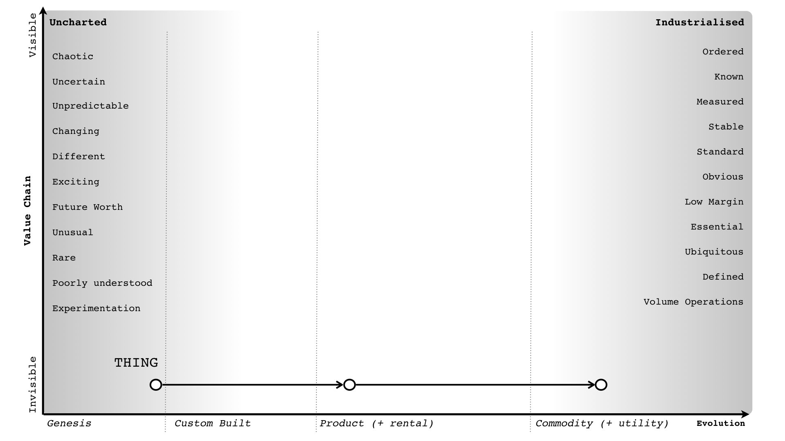

Is Agile a commodity?
---------------------
Source: https://twitter.com/swardley/status/1014879503179550721?s=20

image:https://upload.wikimedia.org/wikipedia/en/a/ac/Pointy-haired_Boss.png[X,30]: Isn't Agile a commodity?

image:https://pbs.twimg.com/profile_images/180727117/Simon_400x400.jpg[Simon,30]: When we talk about practices / methods, we use slightly different labels for stages I to IV i.e. novel to best. Yes, practices evolve

but methods have a context they apply to i.e. Agile (as in XP) is good becoming best practice for that genesis / early custom phase, whereas six sigma is best practice for the more industrialised. So, as some "Thing" evolves, the practice you use changes.

so in social practice theory (assuming I'm getting this right, a big assumption) then you have two meanings (i.e. the THING being built and the PROJECT METHODOLOGY) ... but ...

the THING being built has three separate material instances and the project methodology represents three separate capabilities, each one linked to one material instance ...

The way I traditionally represent this is with the following:

... and use the following to describe how to implement it (though this requires you to break a project into small components).
But yes, Agile (XP) is becoming more "commodity" / "best"  practice for dealing with the genesis / early custom phases ...

image:6.jpg[]

However, there is a problem in that there are people trying to make "Agile" apply to everything, often by co-opting other practices designed for other context into some all signing monstrous mess ... it's madness ...

it's not possible to have a single method cover the entire scale of evolution because the characteristics of activities (i.e. the material) changes as it evolves.

what instead happens is you end up with a monstrous method which fails and people blame others for using the wrong bit of the method. It's a path to cults, failure and process over people  in the name of "Agile" ... it's a farce.
Generally when you have a manager going on about how we should Agile all the things ... my advice would be to sit them down in the corner of a room, with a child safe toy whilst the adults get on with real work.

image:https://upload.wikimedia.org/wikipedia/en/a/ac/Pointy-haired_Boss.png[X,30]: There is no need to be rude.

image:https://pbs.twimg.com/profile_images/180727117/Simon_400x400.jpg[Simon,30]: I've been pointing out this one size fits all method stuff is nonsense since OSCON 2007 I really don't have the patience to continue to listen to people who don't think about context and come up with magic methods that fit all.  ... I have had the same arguments with members of the Agile, the Lean and the Six Sigma crowds over the years. The methods have a context in which they work. They don't work everywhere. Learn to use methods appropriate to the context.
