Is Agile a commodity?
---------------------
Source: https://twitter.com/swardley/status/1214919092513185793?s=12

image:https://upload.wikimedia.org/wikipedia/en/a/ac/Pointy-haired_Boss.png[X,30]: Any thoughts on Agile?

image:https://pbs.twimg.com/profile_images/180727117/Simon_400x400.jpg[Simon,30]: Hmmm ... I assume you mean XP (as in @KentBeck). It's excellent, a really good method in the right context.

image:https://upload.wikimedia.org/wikipedia/en/a/ac/Pointy-haired_Boss.png[X,30]: So you would always recommend using it?

image:https://pbs.twimg.com/profile_images/180727117/Simon_400x400.jpg[Simon,30]: In the right context, yes.

image:https://upload.wikimedia.org/wikipedia/en/a/ac/Pointy-haired_Boss.png[X,30]: What's the wrong context?

image:https://pbs.twimg.com/profile_images/180727117/Simon_400x400.jpg[Simon,30]: When it's not suitable.

image:https://upload.wikimedia.org/wikipedia/en/a/ac/Pointy-haired_Boss.png[X,30]: How do you know if it's not suitable?

image:https://pbs.twimg.com/profile_images/180727117/Simon_400x400.jpg[Simon,30]: Use a map.

image:https://upload.wikimedia.org/wikipedia/en/a/ac/Pointy-haired_Boss.png[X,30]: How does that help?

image:https://pbs.twimg.com/profile_images/180727117/Simon_400x400.jpg[Simon,30]: Do you understand how things evolve?

image:https://upload.wikimedia.org/wikipedia/en/a/ac/Pointy-haired_Boss.png[X,30]: You mean like better products?

image:https://pbs.twimg.com/profile_images/180727117/Simon_400x400.jpg[Simon,30]: Hmmmm ...

image:https://pbs.twimg.com/profile_images/180727117/Simon_400x400.jpg[Simon,30]: Let us take a "Thing". It could be anything, for the sake of this example let us pretend it is the introduction of teleportation. Now obviously, teleportation will be something very novel and new which we will barely understand but we will marvel at its wonder.

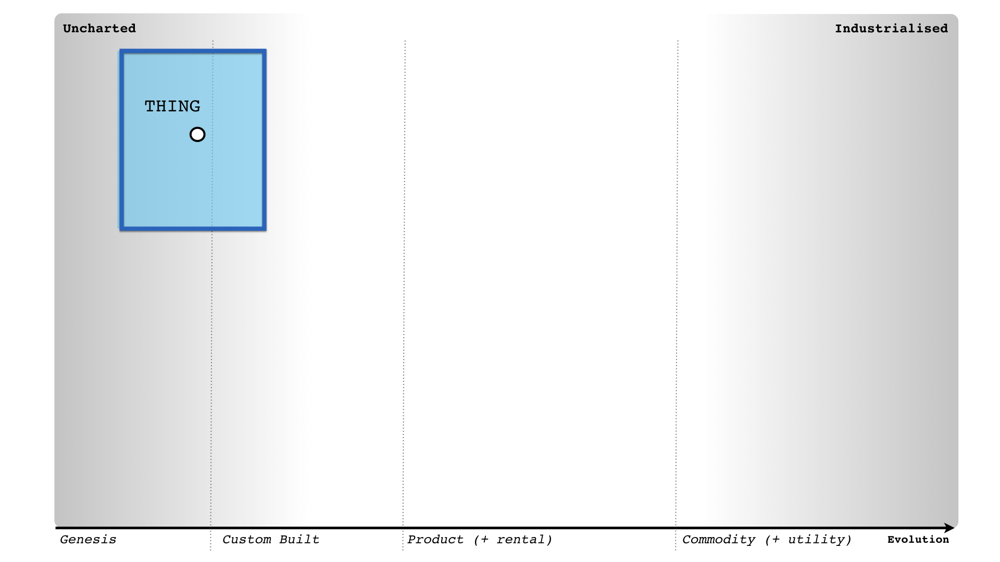

now, if you introduce teleportation then others will copy. Before you know it, we will have competing forms, competition run amok until it becomes so widespread and commonplace it's more of a commodity. Teleportation will evolve through different material instances.

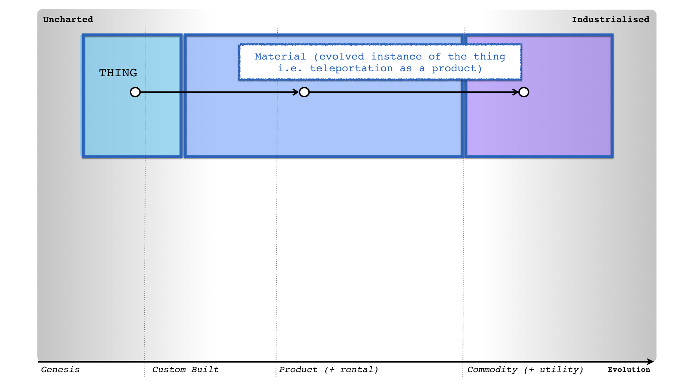

I use the words different material instances because the characteristics will be different. In early stages, the thing (i.e. teleportation) is in an uncharted space and all unknown. As it evolves (through hundreds of diffusion curves) it becomes more defined, more understood.
So, what you have are different material instance of the thing but they all share the same meaning (i.e. teleportation). At this point, go read some Elizabeth Shove and Social Practice Theory.

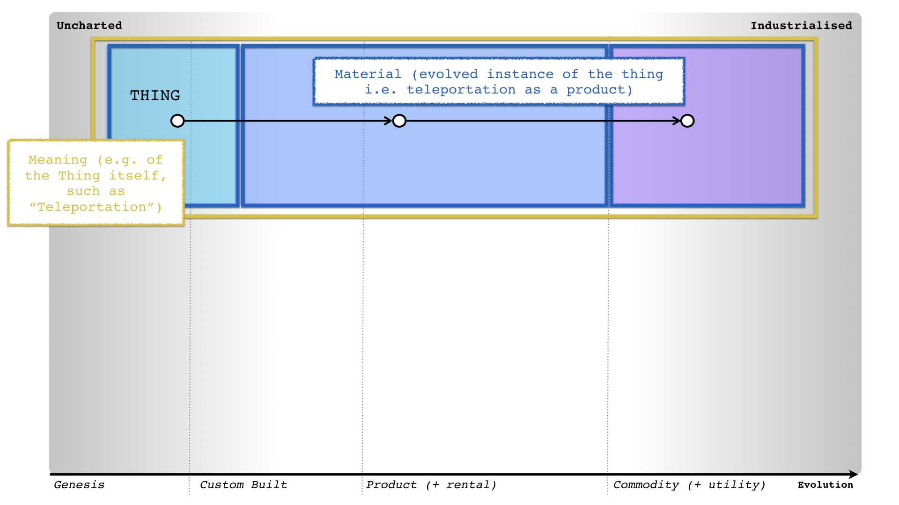

Now it's not just things that evolve but practices. So, for example, XP (i.e. Agile) has evolved to become very good at dealing with that uncharted space where change is a constant, a desirable.  It's very competent at this.

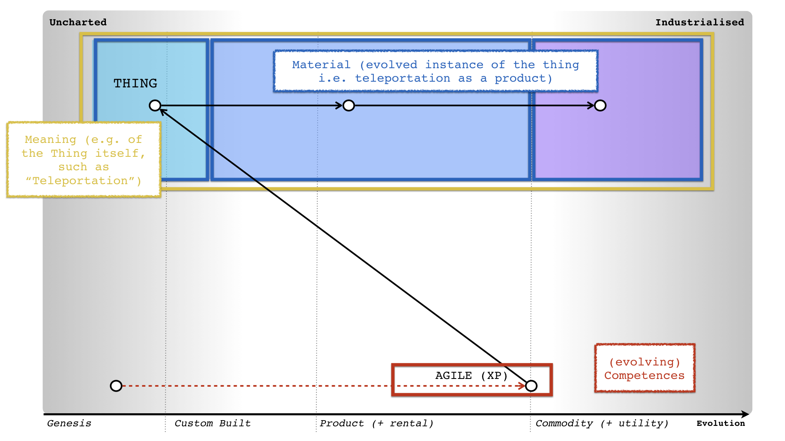

But there are other competencies i.e. lean and six sigma which are very good (i.e. competent) at different material instances i.e. six sigma is great for utility and volume operations where deviation is undesirable. Of course, these techniques themselves have evolved.

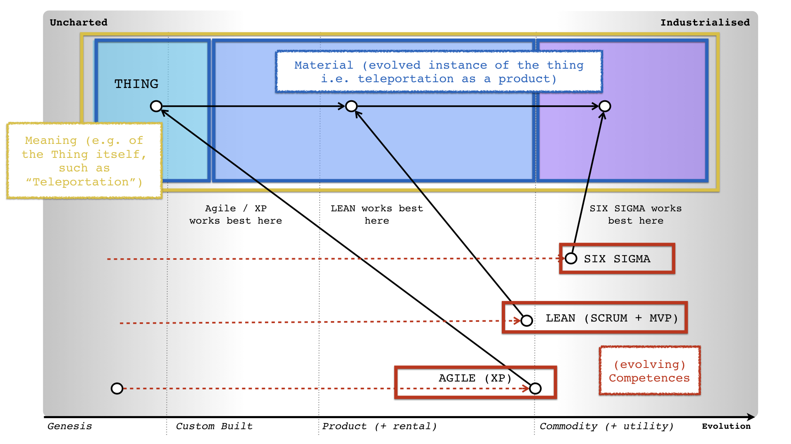

Now, despite them being very different competencies (agile is not six sigma) they share a common meaning e.g. project development.

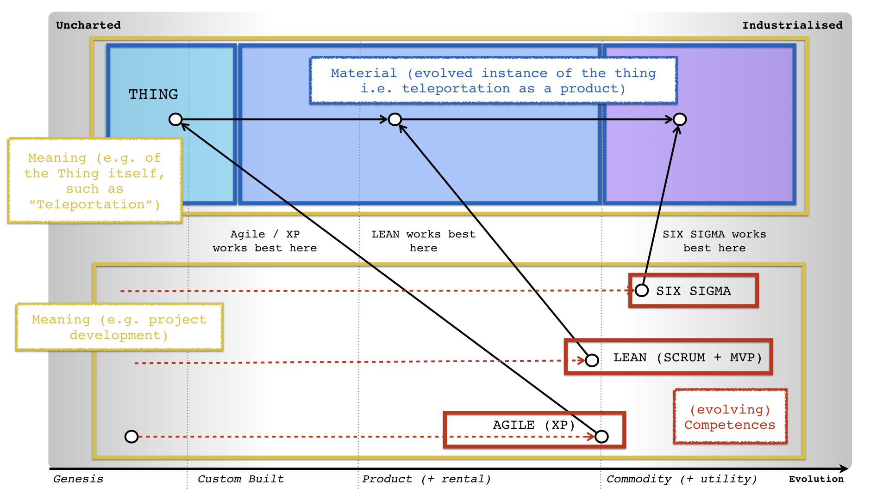

Each competency is suited for a particular material instance because they cope with different characteristics. Unfortunately people always want to create the "magic one size fits all method" - it never works, never will.

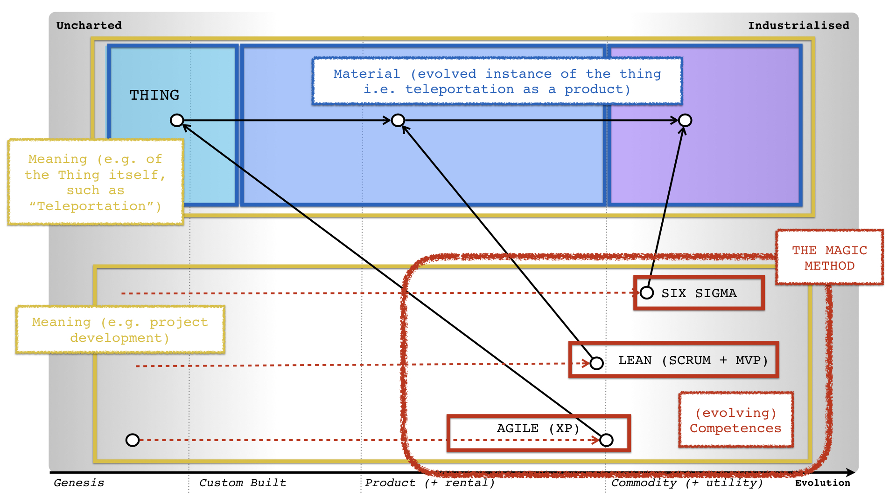

What you need to realise is something which I've been banging on about for now 15 years ... 15 bloody years ... christ ... you need to use appropriate methods.

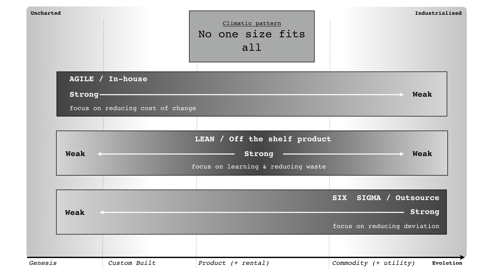

In order to do so, you first need to map your environment i.e. start with user needs and deconstruct the environment into components ...

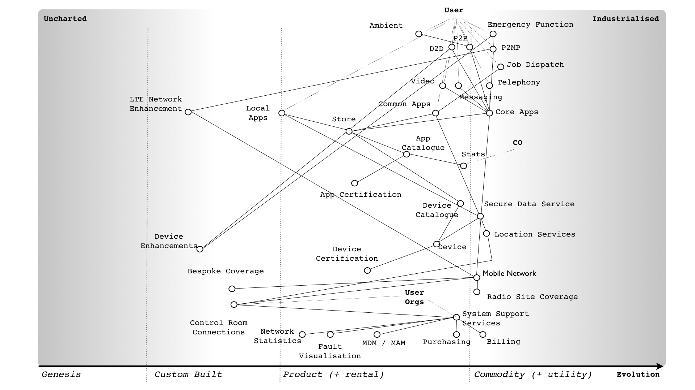

then you can apply multiple methods to it. What you discover is almost all large systems require multiple methods i.e. all that outsource everything, agile everything, neoliberal everything, centrally plan everything is just bullshit from the hard of thinking.

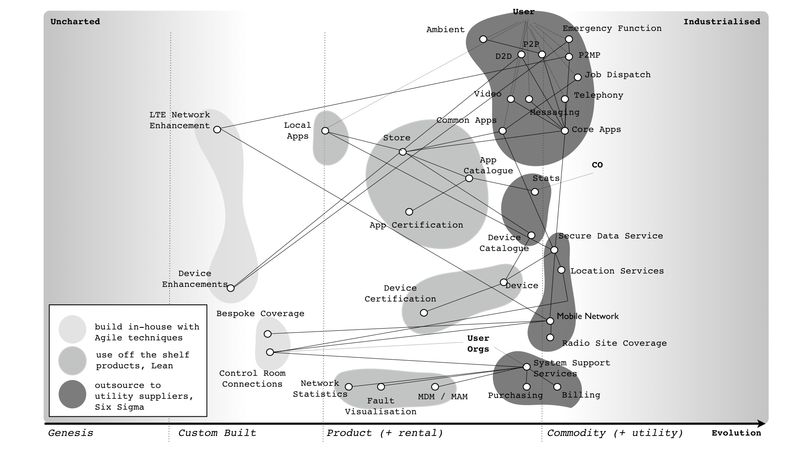

What you discover is you can't do any of this stuff based on stories and I'm a grumbly sod having to repeat this again.

This was solved 15 years ago.  Outsourced a project and it led to massive cost overruns or Agile didn't deliver? Chances are, you're just an effing idiot.

image:https://upload.wikimedia.org/wikipedia/en/a/ac/Pointy-haired_Boss.png[X,30]: That's harsh.

image:https://pbs.twimg.com/profile_images/180727117/Simon_400x400.jpg[Simon,30]: I have no time for those looking for a magic one size fits all. Map your landscape, apply some thought to it.
If you want a more forgiving version then talk to kind people like @kda , @HiredThought , @CatSwetel , @lunivore , @Rachel0404 , @GoAgileGov etc etc.

There's an entire community online around Mapping.  @jhngrant does a wonderful job of keeping an awesome list together - https://github.com/wardley-maps-community/awesome-wardley-maps
Get involved, ask people for help.

image:https://upload.wikimedia.org/wikipedia/en/a/ac/Pointy-haired_Boss.png[X,30]: What do you think about SAFe?

image:https://pbs.twimg.com/profile_images/180727117/Simon_400x400.jpg[Simon,30]: Seriously? Is this poke the bear until it chews your arm off day? It has a context in which it works but it is trying to become the magic one size all encompassing method.
Go Wagileleansigmafall that project!

image:https://upload.wikimedia.org/wikipedia/en/a/ac/Pointy-haired_Boss.png[X,30]: Isn't mapping a one size fits all?

image:https://pbs.twimg.com/profile_images/180727117/Simon_400x400.jpg[Simon,30]: Mapping doesn't tell you what to do, it just helps you create a common understanding of a landscape and challenge the choices that you are making. To decide what you need to do, you take a map and apply thought / experience to it ...

others can then challenge until you get to an agreement. This should be a quick process and what mapping has taught me, is there are no size fits all methods to project management, finance, HR, operations, purchasing etc etc etc. You need to use multiple.
My form of mapping is however a very imperfect one size fits all method to creating a map ... it does this one thing. Fortunately, there are slowly other forms of maps appearing,

image:https://upload.wikimedia.org/wikipedia/en/a/ac/Pointy-haired_Boss.png[X,30]: Like mind maps?

image:https://pbs.twimg.com/profile_images/180727117/Simon_400x400.jpg[Simon,30]: That's not a map, it's a graph. Most things we call maps in business aren't actually maps.

image:https://upload.wikimedia.org/wikipedia/en/a/ac/Pointy-haired_Boss.png[X,30]: What's the difference?

image:https://pbs.twimg.com/profile_images/180727117/Simon_400x400.jpg[Simon,30]: In a map, space has meaning.

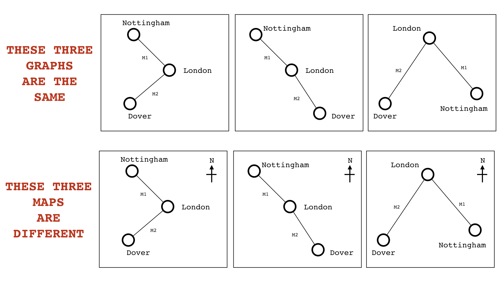

image:https://upload.wikimedia.org/wikipedia/en/a/ac/Pointy-haired_Boss.png[X,30]: How do you maps fit in with @snowded Cynefin?

image:https://pbs.twimg.com/profile_images/180727117/Simon_400x400.jpg[Simon,30]: Cynefin is an excellent decision making framework, it helps you decide what to do / how to respond. Understanding your landscape can assist in that. They are complimentary and have a common basis.

image:https://upload.wikimedia.org/wikipedia/en/a/ac/Pointy-haired_Boss.png[X,30]: Aren't your evolutionary stages ...

image:https://pbs.twimg.com/profile_images/180727117/Simon_400x400.jpg[Simon,30]: No. Let us take the map of culture (slightly different axis). You have some fairly obvious concepts (1), some more novel to emerging concepts (2), you have complex behaviour through feedback loops (3) and the map is complicated (4) ...

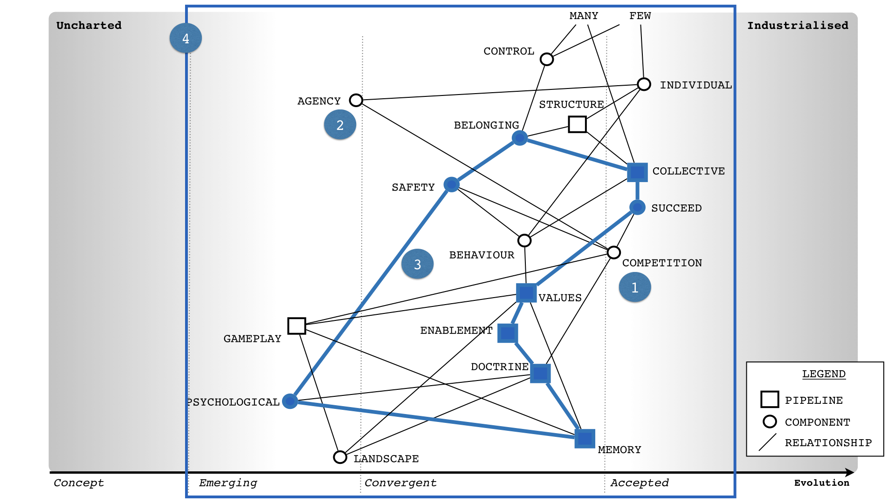

Now, let us look at where I started. This is my first map of culture.

So to begin with, it's all chaos, I have nothing to base anything upon. The map itself emerged out of interrogation, investigation and experimentation.

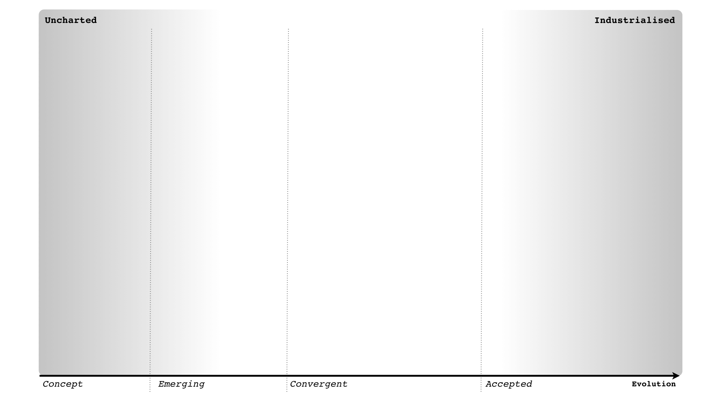

this doesn't mean culture didn't exist before, it certainly doesn't mean that my map of culture is right but the nature of my decisions, what I do to refine my view changes as I gain more understanding of the space.
As a guide to helping you make those choices, those decisions ... I can't think of anything better than Cynefin.

