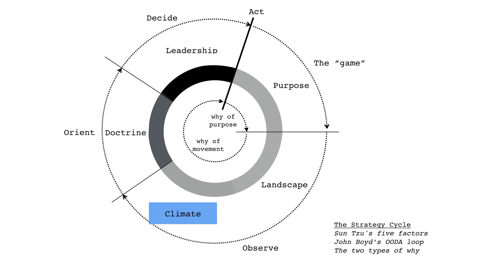
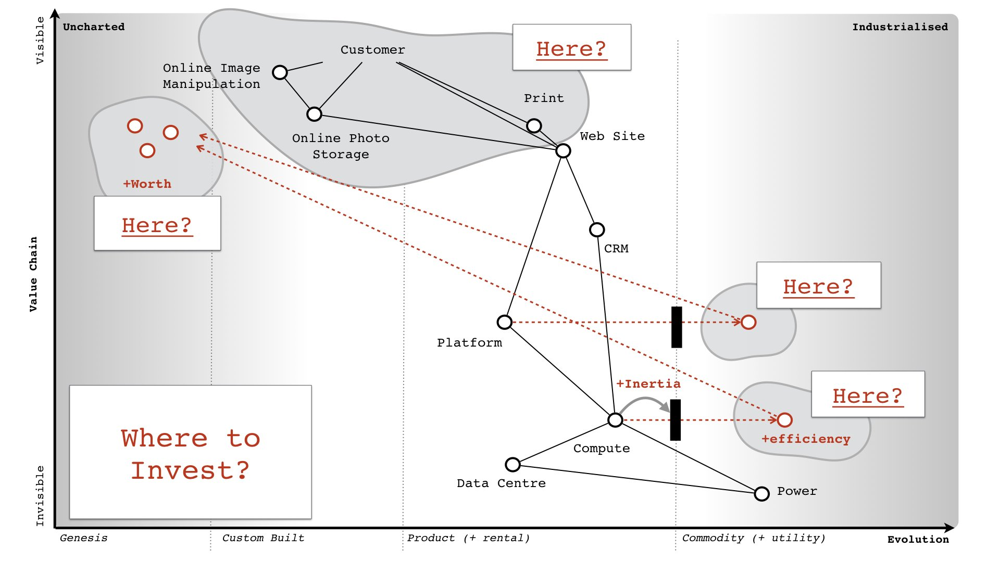

# Capability models and mapping 

## Source from [twitter](https://twitter.com/swardley/status/993517588113186817)

Asked about capability models and mapping. 

When I look at organisations, I tend to examine **doctrine** to give me an idea of how adaptable they are / how well they'll respond to any gameplay. 

It's a very crude method but useful.

### Competition

With most competitors, you can play any game you like against them. They won't generally see it coming nor have any idea how to react nor have the ability to adapt. There are only a handful of competitors you have to pay attention to. Most of the time, you can just ignore them.

However, the problem is of course that most companies don't understand their landscape or have any effective means of sensing change. 

If you're in that boat then most competitors can safely ignore you and any plans that you come up with. It's all guesswork / meme copying etc.

> X: Can you tell us what our profile looks like?

**Simon**: No. Just grab 10-15 people across the organisation (at different levels) and get them to colour the boxes in. Be warned, there'll be lots of arguments but that's not a bad thing.

If you want to go about fixing doctrine in an organisation, then I strongly suggested you do this in phases. My best guess at the order in which you should tackle them is

... however, the exact order / what phases to use really depends upon your context / your circumstances etc. So, take this as a rough "maybe useful" guide and nothing more.

> X: What's the relationship between strategy and doctrine?

**Simon**: Very little other than your first strategy should be "stopping self harm" i.e. fixing doctrine. If you're in that boat, ignore any other discussion of strategy until you do. 

## Some basics pointers ...

### Understand the landscape

When it comes to the strategy cycle, maps are the means for attempting to understand the landscape - they are useful for communication, learning and challenge. This however is just the first step ...

### Applying climatic patterns

... as you get better at mapping you will start to learn climatic patterns (i.e. the rules of the game. There are 30+ of these). This is useful for anticipation of change and identifying where to invest.

### Discover patterns - Doctrine and gameplay

You will over time discover patterns that you have choice over. Some are context specific (gameplay), some are universal (doctrine). Doctrine (there are 40+ of these) will help you reduce "self harm" in an organisation and structure yourself.

#### And the anticipate

As you continue to learn, you will discover context specific play (i.e. gameplay. There are 70+ of these). You can then use anticipation (where) + doctrine (yourself and competitors) + gameplay to scenario plan how to attack a space.

### Looping

As you loop around the cycle, you will get better in all these aspects using past maps to learn from (how you acted vs what happened). After a decade of practice, you can safely add "strategist" to your job description without me mocking you.

### About strategy

I'm not kidding on the mocking. Strategy is a craft that takes dedication. It starts with understanding your landscape. Ask yourself the following

_P.S._ you won't learn from maps if you don't use then, you won't learn from past SWOTs / biz models / P&L ... period.

Actually, the last bit is not quite true. Of around 300 people I've asked (covering MBAs + Biz people), I did meet one who claimed to have re-read and learned from a past biz model and SWOT. So, it's more a case of learning very little from the past.

### Maps are not easy

Another common complaint about maps is "they're not easy" ... well, that's a fair point.

They create a lot of discussion, challenge, questioning and yes a 2x2 is a lot easier. 

Even easier is just click the link to the auto strategy generator -  https://strategy-madlibs.herokuapp.com

## Context matters

Of this entire thread however, the one message I want you to take home is that "context matters". This is what mapping is all about - finding a way to examine, communicate and learn from the context in which we operate.

Doctrine list is simply a list of  universally useful patterns. Most patterns are context specific. Even the effective implementation of doctrine requires you to understand context i.e. focus on user needs (universal) varies with implementation (i.e. what needs to focus on).
