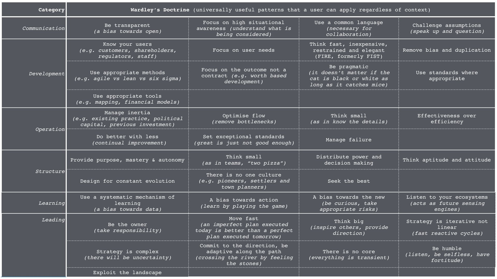
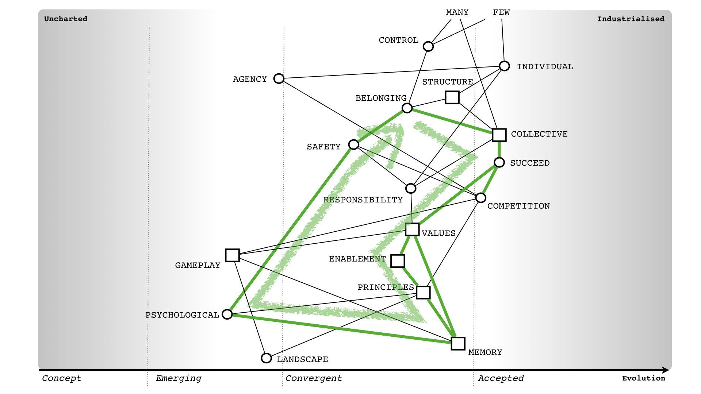
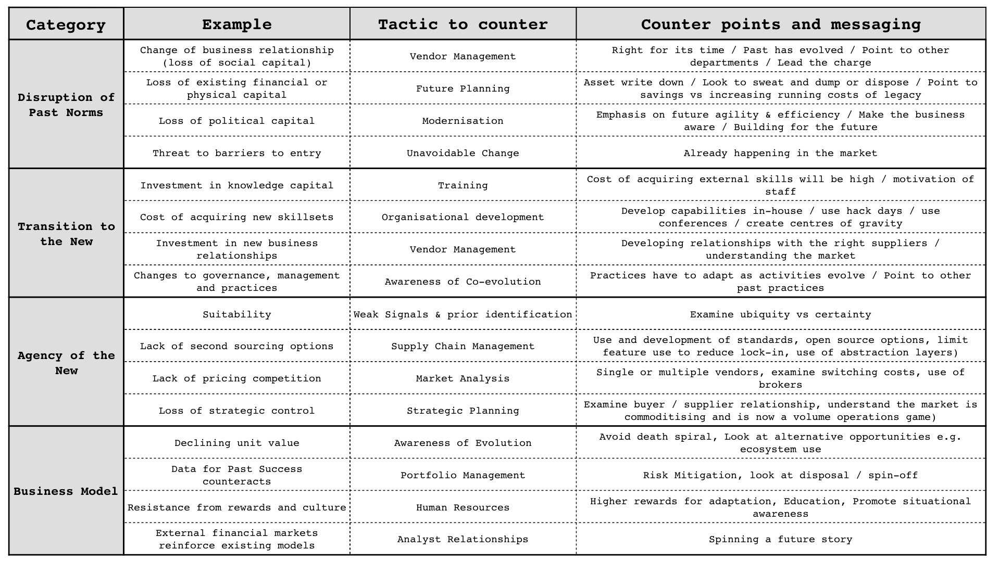

DevOps
------

Source: https://twitter.com/swardley/status/1180087833408745472

image:https://upload.wikimedia.org/wikipedia/en/a/ac/Pointy-haired_Boss.png[X,30] : DevOps is all about the culture.

image:https://pbs.twimg.com/profile_images/180727117/Simon_400x400.jpg[Simon,30] : Hmmm. Ok, let us accept that there exists a collective called DevOps that people want to be part of (for reasons of self advancement). What values does it have?

image:https://upload.wikimedia.org/wikipedia/en/a/ac/Pointy-haired_Boss.png[X,30] : Focusing on using needs, rapid deployment and iteration.

image:https://pbs.twimg.com/profile_images/180727117/Simon_400x400.jpg[Simon,30] : Those aren’t values (as in beliefs), they are universally useful principles (as in actions). Those principles are useful regardless of what collective you’re talking about. What are the beliefs / the values?

image:https://upload.wikimedia.org/wikipedia/en/a/ac/Pointy-haired_Boss.png[X,30] : Communication and collaboration.

image:https://pbs.twimg.com/profile_images/180727117/Simon_400x400.jpg[Simon,30] : Again, effective communication is an action and part of collaboration (another action) and the need for challenge (another action). All are universal useful principles i.e. doctrine. Here’s a list. Now give me the values of DevOps.

image:https://upload.wikimedia.org/wikipedia/en/a/ac/Pointy-haired_Boss.png[X,30] : Continuous improvement? Automation?

image:https://pbs.twimg.com/profile_images/180727117/Simon_400x400.jpg[Simon,30] : Continuous improvement is on the list. Automation is a context specific play i.e. you can’t automate genesis, you can only automate those things which are more late product heading to commodity. So, once again values?

image:https://upload.wikimedia.org/wikipedia/en/a/ac/Pointy-haired_Boss.png[X,30] : Trust.

image:https://pbs.twimg.com/profile_images/180727117/Simon_400x400.jpg[Simon,30] : Finally we have a belief, a quality, a value. Trust in what?

image:https://upload.wikimedia.org/wikipedia/en/a/ac/Pointy-haired_Boss.png[X,30] : Trust in each other, in the promises we make.

image:https://pbs.twimg.com/profile_images/180727117/Simon_400x400.jpg[Simon,30] : So does every other collective. That’s a norm. There are no long lasting collectives with a value of “we don’t trust each other”

image:https://upload.wikimedia.org/wikipedia/en/a/ac/Pointy-haired_Boss.png[X,30] : I don’t see your point.

image:https://pbs.twimg.com/profile_images/180727117/Simon_400x400.jpg[Simon,30] : DevOps is a set of principles, ones which are universally useful. It’s a movement to diffuse those principles. Those principles will be absorbed and the very reason for the flag and identity of DevOps will cease to exist.<Paste>

image:https://upload.wikimedia.org/wikipedia/en/a/ac/Pointy-haired_Boss.png[X,30] : And the point being?

image:https://pbs.twimg.com/profile_images/180727117/Simon_400x400.jpg[Simon,30] : DevOps is not a collective with a set of values and a specific culture … it is a marketing exercise, one which has benefits in diffusing a set of universally useful principles. It is transient and the idea of a DevOps culture is just pure bullshit.

image:https://upload.wikimedia.org/wikipedia/en/a/ac/Pointy-haired_Boss.png[X,30] : I disagree.

image:https://pbs.twimg.com/profile_images/180727117/Simon_400x400.jpg[Simon,30] : Give it 10-15 years and no-one will be talking DevOps, any more than they are talking Web 2.0 today.

image:https://upload.wikimedia.org/wikipedia/en/a/ac/Pointy-haired_Boss.png[X,30] : What’s Web 2.0?

image:https://pbs.twimg.com/profile_images/180727117/Simon_400x400.jpg[Simon,30] : It’s a new cultural phenomenon that … nah, it was a marketing term for set of universally useful principles.

image:https://upload.wikimedia.org/wikipedia/en/a/ac/Pointy-haired_Boss.png[X,30] : This time it’s different.

image:https://pbs.twimg.com/profile_images/180727117/Simon_400x400.jpg[Simon,30] : Ah … “trust” us? Every collective that has a single value based around a belief in trust tends to discover that it’s a marketing exercise for something else. Even cults have more values than that though I’m not saying that’s a good thing.

image:https://upload.wikimedia.org/wikipedia/en/a/ac/Pointy-haired_Boss.png[X,30] : Culture is important.

image:https://pbs.twimg.com/profile_images/180727117/Simon_400x400.jpg[Simon,30] : Yes, but culture depends upon many components interacting with each other in a landscape of competing collectives with different values. Universal principles are useful to all collectives. That’s what DevOps is, principles not values nor a culture.
in other words, culture is not relevant except when I’m selling you a book on DevOps Culture in which case I need you to “trust” me that the book is worthwhile. It's good marketing.

image:https://upload.wikimedia.org/wikipedia/en/a/ac/Pointy-haired_Boss.png[X,30] : Are you anti DevOps?

image:https://pbs.twimg.com/profile_images/180727117/Simon_400x400.jpg[Simon,30] : Are you a religion? What’s your values? Let me guess ... trust?

image:https://upload.wikimedia.org/wikipedia/en/a/ac/Pointy-haired_Boss.png[X,30] : I don't get the point?

image:https://pbs.twimg.com/profile_images/180727117/Simon_400x400.jpg[Simon,30] : You have no values beyond "trust" as in "trust us". DevOps is a set of universally useful principles applicable to all collectives regardless of their culture. There is no DevOps culture, there are just a set of principles to be acted upon.

image:https://upload.wikimedia.org/wikipedia/en/a/ac/Pointy-haired_Boss.png[X,30] : But those principles could change the culture of an organisation?

image:https://pbs.twimg.com/profile_images/180727117/Simon_400x400.jpg[Simon,30] : Of course. But culture depends upon many components (see map). You can't boil this down to a DevOps culture i.e. we should all be like this. Culture doesn't work like that except in magic formula.

image:2.jpg[]

image:https://upload.wikimedia.org/wikipedia/en/a/ac/Pointy-haired_Boss.png[X,30] : So, I shouldn't do DevOps?

image:https://pbs.twimg.com/profile_images/180727117/Simon_400x400.jpg[Simon,30] : You should certainly take universally useful principles and apply them to your organisation i.e. focus on user needs, challenge assumptions, use a common language etc etc ... you need to also be mindful of how your culture will react / respond.

image:https://upload.wikimedia.org/wikipedia/en/a/ac/Pointy-haired_Boss.png[X,30] : How do you mean?

image:https://pbs.twimg.com/profile_images/180727117/Simon_400x400.jpg[Simon,30] : There are various loops in culture that you have to be mindful of. One loop (see map) can create a positive flywheel effect or a doom loop if you mess it up.

image:https://upload.wikimedia.org/wikipedia/en/a/ac/Pointy-haired_Boss.png[X,30] : An example?

image:https://pbs.twimg.com/profile_images/180727117/Simon_400x400.jpg[Simon,30] : Go make an announcement in your town hall or newsletter or vision statement (a system of engagement) that you're going to all become a new DevOps culture (and by implication the past culture wasn't good enough). Watch that sense of belonging tumble
alternatively, try an approach of saying we're going to adopt some DevOps principles into our organisation such as a "focus on user needs". Cultures can adapt and adopt to new universally useful principles without wrecking the existing culture or the values it is based on.
Of course, if you really want to kill performance in an organisation then announce you're going to become a DevOps culture, that you're hiring new blood to bring that culture into the organisation and show you mean business by firing someone that disagrees (i.e. impact safety).

image:https://upload.wikimedia.org/wikipedia/en/a/ac/Pointy-haired_Boss.png[X,30] : What about inertia?

image:https://pbs.twimg.com/profile_images/180727117/Simon_400x400.jpg[Simon,30] : All organisations have that. It can be managed (see list). You don't have to wreck a culture whilst doing this if you're vaguely competent.  PS. A map plus climatic (i.e. common economic) patterns is useful for anticipation of such impacts.

image:https://upload.wikimedia.org/wikipedia/en/a/ac/Pointy-haired_Boss.png[X,30] : Sometimes we need to change rapidly, a short sharp shock is needed.

image:https://pbs.twimg.com/profile_images/180727117/Simon_400x400.jpg[Simon,30] : In my experience, most of those cases are down to exec failure to anticipate effectively. The problem you have is a collective has a memory. That "shock" will ripple through your future culture.

image:https://upload.wikimedia.org/wikipedia/en/a/ac/Pointy-haired_Boss.png[X,30] : But if we have strong values, people will rally around that?

image:https://pbs.twimg.com/profile_images/180727117/Simon_400x400.jpg[Simon,30] : Tricky. I've seen too many organisations that have either resorted to gang mentality or show signs of abuse to know that strong values can only be used to paper over some sins for so long.

image:https://upload.wikimedia.org/wikipedia/en/a/ac/Pointy-haired_Boss.png[X,30] : This is a recipe for doing nothing.

image:https://pbs.twimg.com/profile_images/180727117/Simon_400x400.jpg[Simon,30] : No, it's an example of why you need to think. It's important to understand your landscape, your real values (not just useful principles like "focus on user needs") and the state of your culture.

image:https://upload.wikimedia.org/wikipedia/en/a/ac/Pointy-haired_Boss.png[X,30] : That's too much.

image:https://pbs.twimg.com/profile_images/180727117/Simon_400x400.jpg[Simon,30] : 2x2?

image:https://upload.wikimedia.org/wikipedia/en/a/ac/Pointy-haired_Boss.png[X,30] : Yes please.

image:https://pbs.twimg.com/profile_images/180727117/Simon_400x400.jpg[Simon,30] : Lol. The general who wins the battle makes many calculations in his temple before the battle is fought. The general who loses makes but few calculations beforehand.

image:https://upload.wikimedia.org/wikipedia/en/a/ac/Pointy-haired_Boss.png[X,30] : What culture does mapping have?

image:https://pbs.twimg.com/profile_images/180727117/Simon_400x400.jpg[Simon,30] : It doesn't. It's a set of tools designed to encourage universally useful principles of communication (a necessity for collaboration) and challenge. It has a context specific play being open
on the community we are fostering values of inclusion and encouraging the idea of collective good rather than the individual i.e. community, government, environmental concerns, positive impacts beyond wealth (i.e. saving lives)
it also has "two enemies" or competing collectives (something which is always useful for a collective).

The first being "one size fits all" (a competing belief) and the second being "management consultants that enslave us".

image:5.jpg[]

which is why I talk about freeing us from the tyranny of one size fits all (i.e. agile everywhere, six sigma everywhere) and a focus on more context specific approaches.
But those beliefs of freedom from tyranny, inclusion and collective good are my beliefs which I impose. i.e it's not mapping that creates those values, mapping is simply the vehicle I use to try and foster those values in the community.

image:https://upload.wikimedia.org/wikipedia/en/a/ac/Pointy-haired_Boss.png[X,30] : How do you do that?

image:https://pbs.twimg.com/profile_images/180727117/Simon_400x400.jpg[Simon,30] : By use of gifting. I found mapping useful to me hence I gifted it under creative commons but this was a deliberate act, a collective approach of sharing to help others.
however, I'm also mindful that by using these techniques to impose my own values onto a community runs the risks of creating a cult. Which is why I'm also deliberately encouraging others to lead, to take control of parts of the community, to drive aspects of change.
So, mapping itself has no cultural aspect but the community ... well, I'm certainly trying to shape it, a bit like a gardener shapes a garden by encouraging growth, fostering certain types of blooms etc. But this is also a community of volunteers, no-one works for "mapping"
it requires many of those skills I learned running guilds in MMORPGs. It's a very imperfect and fluid exercise. The technique is diffusing, whether it'll create a collective with its own culture that goes beyond mapping including its own distinct values .... we shall see.
