[source](https://twitter.com/swardley/status/1087511545091899392)

## Silos

In the old days, this is how I use to organise by silos based around aptitude e.g. skillsets such as engineering and finance. 

There was always fight between silos and even within silos:

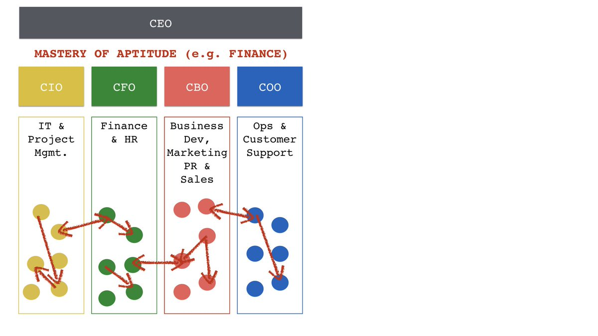

Then after a bit of time, I introduced the idea of small teams with product owners.

The small teams had a mix of aptitudes (i.e. skills).

The result was **more fights**.

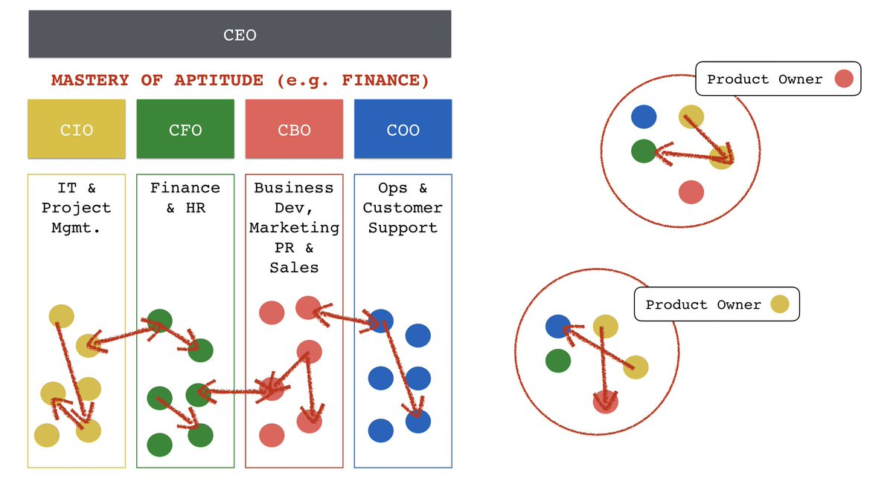

Then around 2004, I had an amazing idea. 

The conflict was caused by two types of work: _the new development_ and _core operations_.

The solution was simple, **split the company into two different focus**. 

I started with IT.

The result was all out warfare and endless fights: 

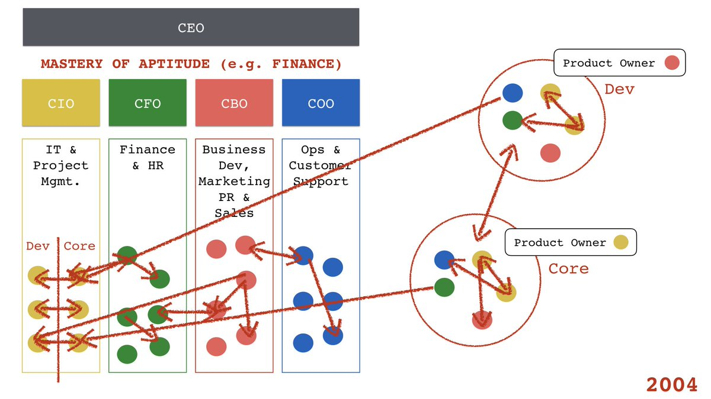

## Understanding what happened

By 2005 I had maps and could understand what had happened.

Basically, Dev would:

- build on Core services, 
- evolve the technology,
- then ask Core to look after it. 

Core would respond: 

> Where's the documentation

And a **new fight broke out** 

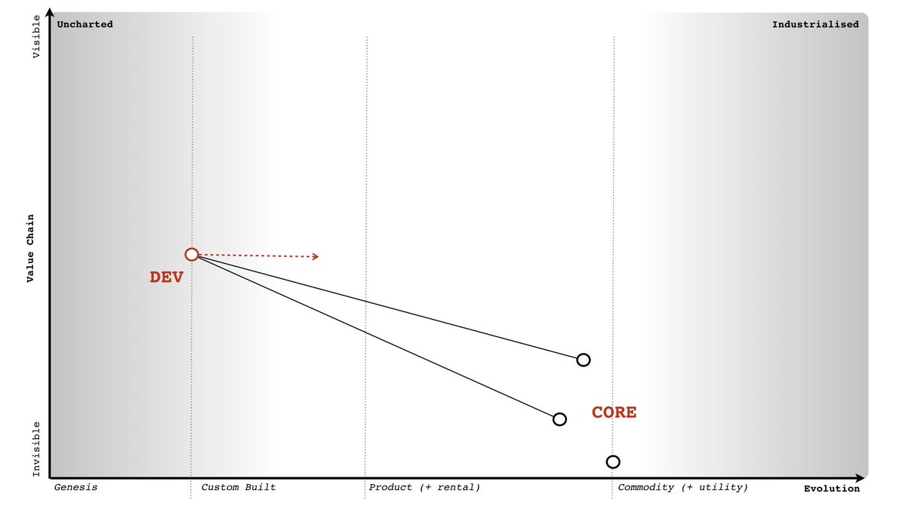

Nothing was ever making the cross over (i.e. nothing evolved across the blue box). 

**Dev had pressure to deliver more**, so it would start to build on components it had made:

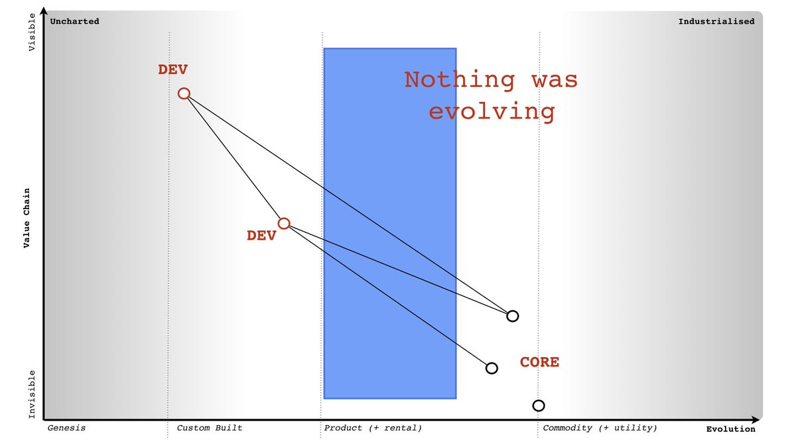

The net result was:

- increasing instability (a house of cards)
- nothing evolving
- open warfare.

I realised, through equal mixes of luck, discussion and articles that I had read, that in our organisation we had a _missing middle_.

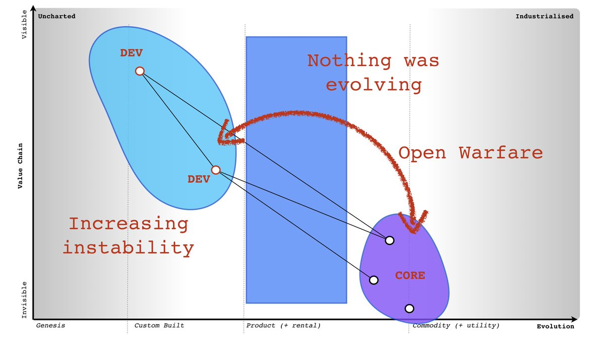

## Fixing the missing middle

So, we set about to fix it. 

Over time we split the organisation into three parts built around attitude 

i.e. engineering isn't just engineering, there are very different approaches needed if you're build the novel or productising or industrialising:

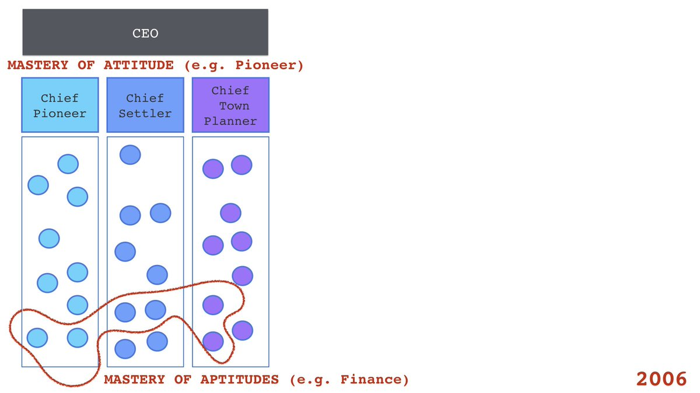

### pionner, settler and town planner

This was the genesis of the whole pioneer, settler and town planner. 

A realisation that different cultures and methods were needed , it didn't matter if it was engineering or finance or marketing. 

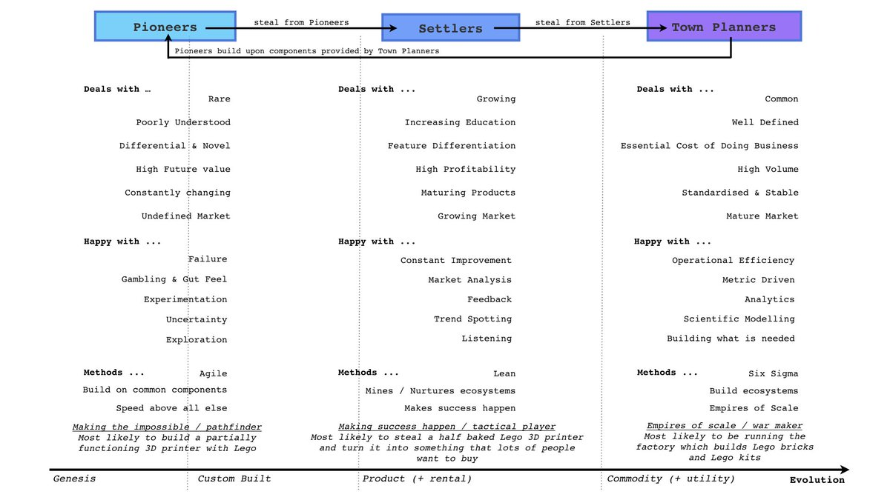

Work was still done in small teams with product owners but those teams had the same attitude (e.g. settler) but a mix of aptitudes (e.g. finance, marketing, development)

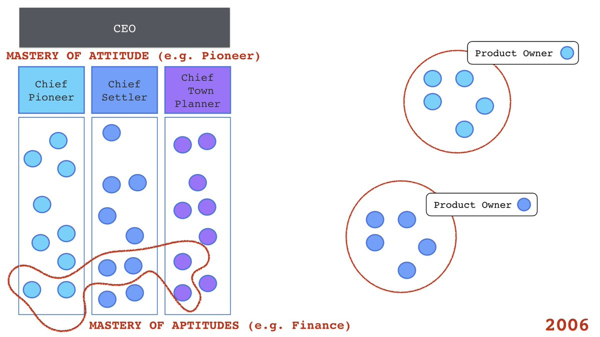

However, we still need to cope with change.

Hence we had a mechanism of theft i.e. what the pioneers did was stolen by settlers and turned into products.

Later the town planners would steal components of this and industrialise it to services which pioneers would use. 

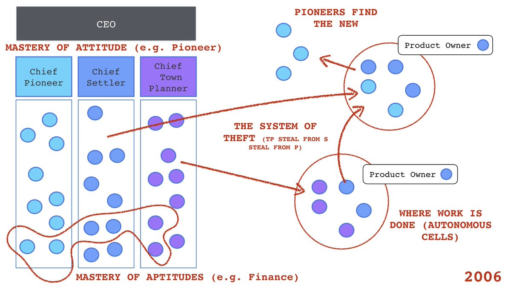

However, to make it work we needed to understand our landscape. 

The structure simply helped us manage evolutionary flow - we still had to break down components into two, determine where we were going to attack etc. 

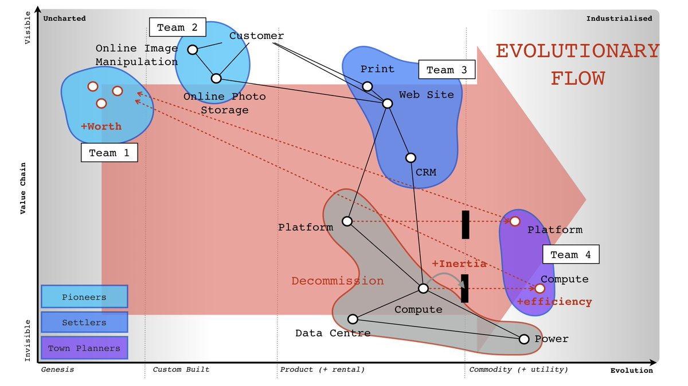

#### Understanding what was wrong

However, it also helped me to understand what went wrong with my earlier efforts. 

From my experience, the Settlers tend to get on with most people but the Pioneers and Town Planners (both of which you need) tend to fight a lot if you stick them in a room together.

In my early efforts, I organised by aptitude (i.e. skills). But those attitudes (pioneer etc) still existed. I was just unaware. I was building depts and teams with pioneers and town planners in. Fights were bound to happen. If you&#39;re using small teams, think about attitude. 

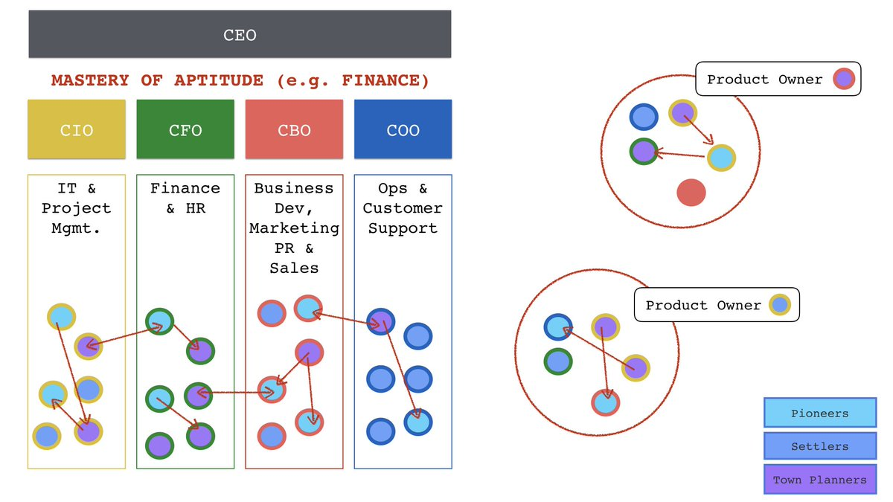

When I split into two focus - _Dev & Core_, I reinforced _Pioneers & Town Planners_. 

I diminished the Settlers (i.e. they had little power). 

Thes just created even **more fights**. 

P.S. This is why I called bimodal hokum when Gartner came out with it. You'll end with internal warfare.

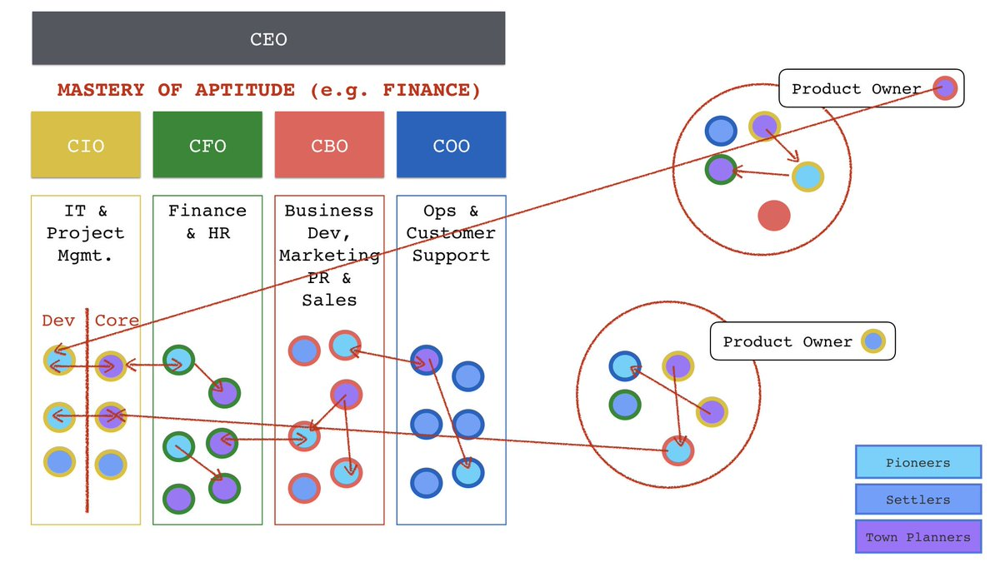

It's not only silos by function, cells or bimodal that can cause problems. 

You need to manage evolutionary flow. That's a problem I see with the Spotify model. 

No mechanism for this, it'll stagnate. 

If you're down that path, read Boiling Frogs by [@gchq](https://github.com/gchq/BoilingFrogs)

Now, these days I don't research into organisational design because the only effective way of doing this is to run a company and experiment directly on it. I don&#39;t trust consultants intuition unless they run their own company this way.

My last experiments on this was 2007.

Unfortunately, most of the work I read on organisational design is fairly dreadful. 

I'm not interested in leadership myself but if you do find yourself in that position, do understand that most are still exploring how to organise themselves. 

No-one has the perfect answer.

Oh, if some consultant turns up with a solution to organisation then ask them to show you how they run their company in this way. You don&#39;t want case studies of others, you want to see them running it for themselves. If they can&#39;t, ask them to close the door on the way out.

I can only tell you where I got to by the end of 2007 and the idea of pioneer, settler and town planner was derived from [Robert X. Cringely](https://en.wikipedia.org/wiki/Robert_X._Cringely) (pseudonym) [Accidental Empires](https://en.wikipedia.org/wiki/Accidental_Empires) concept of "Infantry, Commando and Police" for describing companies.

Just done in one company. There is other work out there of interest, not only the brilliant boiling frogs by [@GCHQ](https://twitter.com/GCHQ)

but also:

- [@KenBeck](https://twitter.com/KentBeck) has a 3X model (Explore, Expand and Extract)
- even [@bfeld](https://twitter.com/bfeld) has ["three machines"](https://www.feld.com/archives/2017/01/the-three-machines.html) (H/T [@__dotblake](https://twitter.com/__dotblake))

If you want to go down this path of pioneer, settler and town planner then someone you must grab (who was there at the beginning of this all including 
#WardleyMaps is [@jamesaduncan](https://twitter.com/jamesaduncan) - there are only a handful of people I've met in my own journey that are as good as James. 

## Map references

X : How is this free?

Me : There is method in my madness, in fact the whole creative commons share alike approach of [#WardleyMaps](https://medium.com/wardleymaps) is driven by a ... well, guess ...

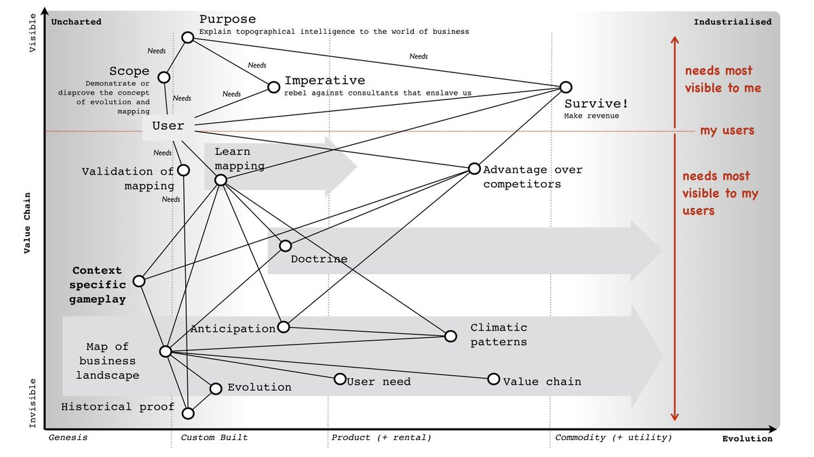

X : How do I learn more about these maps?

Me : There is

- a creative commons, share alike [book](medium.com/wardleymaps)
- an [online course](https://learn.leadingedgeforum.com/p/wardley-mapping/?product_id=277424) by [@kda](https://twitter.com/kda)

Also @kda (aka @wardleymaps), @BenMosior, @jhngrant, @mrchrisadams have various groups and lists. 

Also there's ...

- Map Camp Atlanta - map-camp.com/_pages/2019-04… organised by @cacorriere

- Mapping track at Agile Scotland - eventbrite.co.uk/e/agile-scotla… organised by @kev_austin

- Deep Drive in Australia (with @snowded and I) - thedeepdive.com.au organised by @agileaus 

### PST and focus on autonomy, mastery and purpose

X : So pioneers create and town planners operate?

Me : No. Each team builds, runs and operates in their space but they also consume components from others e.g infrastructure, identity service etc. If they don't then the system collapses in politics. 

X : How do maps provide purpose, mastery and autonomy?

Me : The PST structure provides autonomy (in terms of cells) and allows for mastery in terms of aptitude (e.g. engineering or finance) and attitude (e.g. pioneers).

#### Purpose

X : What about purpose?

Me : You create your team structure based upon the map, the climatic patterns that influence it and where you wish to focus. The maps help you determine the type of attitude you need in any team.

X : Climatic patterns?

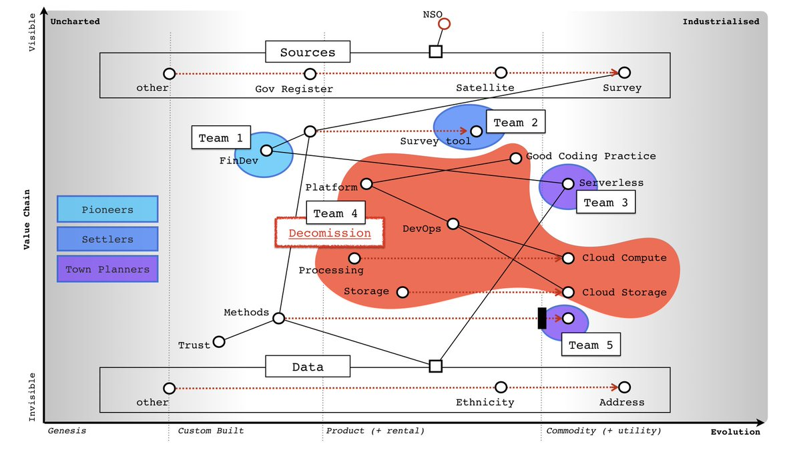

Me : Yes. Maps are dynamic and are effected by patterns e.g. “everything evolves”. If you look at a map, you need to consider where it is going.

X : How does that help in purpose?

Me : Well you have needs and economic patterns so you can explain why we’re doing something …

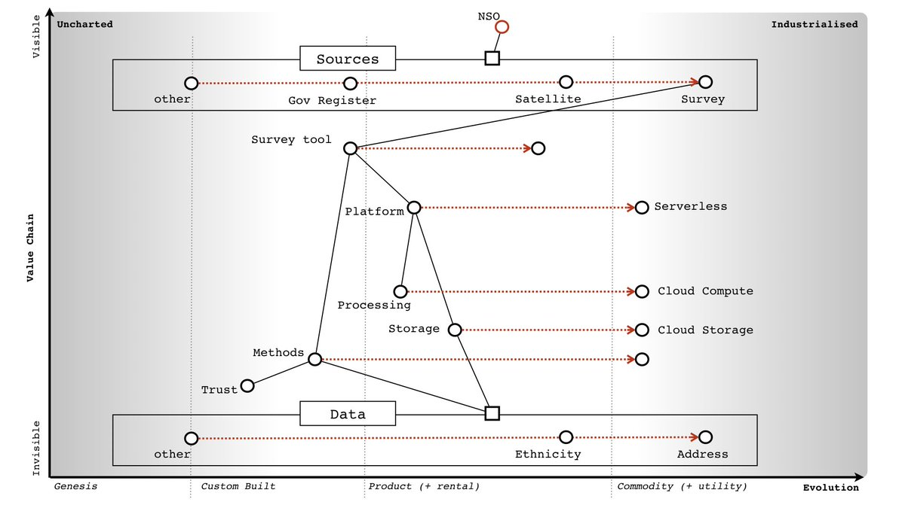

Me : The map is also a part of a larger map. In this case a hypothetical National Statistic Office and how it fits in with the UN.
So you can give direction, who needs to do what and how it fits in with the wider picture. Maps provide a common language for communication.

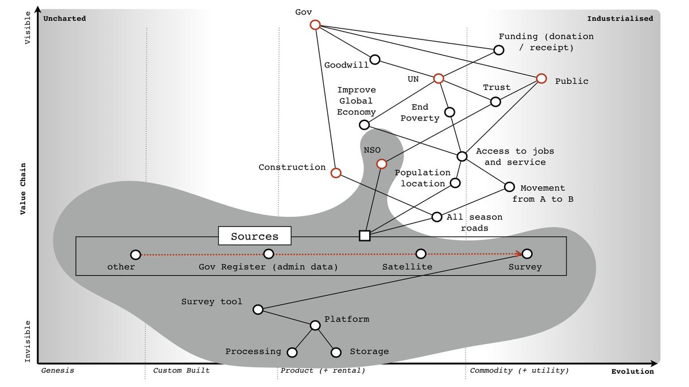

X : Where can I learn more on this?

Me : If you want to learn about maps, purpose, UN global platforms and statistics then follow @mcraddock

[UN Global Platform Handbook on Information Technology Strategy](https://docs.google.com/document/d/1wDoDSeSRwCMtYxRoT8mSGga1Z-d3sx-FG2ekW4isr-A/edit#)

### Maps and government

X : What about Maps and Government?

Me : Follow @JuliePierce77 (Food Standards), @liammax (former UK Gov now Amazon), @simonaclifford (Police), @GoAgileGov (HS2, RNLI), @JanetHughes (Education) and ... there are lots of people in this space. I'll ask them to shout out. 

X : Why don't they tech maps on MBAs?

Me : Some do e.g. @markthompson1 (Judge Business School, Cambridge) or @daeaves (Harvard Kennedy School). There are other academics out there e.g. @RoserPujadas1 and @CloudyGrids (LSE) 

X : Which companies use maps?

Me : Numerous. If you want to learn about maps and competition then follow @adrianco, @kelseyhightower, @MrsDHW, @yoditstanton, @joepindar ... oh, this is a long long list. 

X : Have you written a book?

Me : Partially, over many years. This is about the third effort.
Mostly, mapping is taught by practice. It's all governed by the strategy cycle, the more you loop around the better you get.

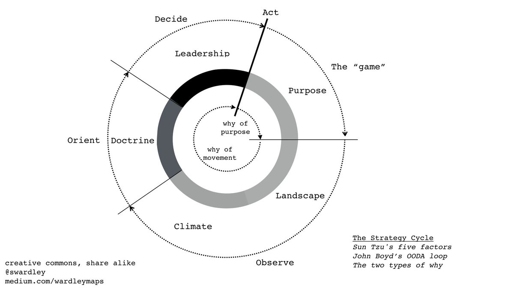

### Advice on implementing PST

X : Any advice on implementing PST.

Me : Don't unless you really know what you're doing and in most cases, I'm afraid that means stop!
You really need to have most of the basics of doctrine (ie. principles of organisation) in place first. Follow @jamesaduncan or @chrisvmcd

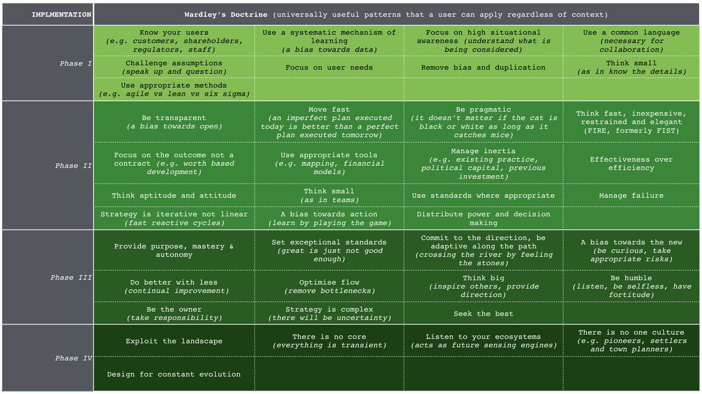

X : Does mapping help in security?

Me : Oh yes. Follow @_tony_richards, @DinisCruz, @VirtualTal and ... long list.

In fact, follow @VirtualTal in all cases. He used maps to help write the [Punch Escrow](https://www.amazon.co.uk/Punch-Escrow-Tal-M-Klein/dp/1942645589/) which if you haven't read - you should -

X : How do you decide what to do with a map?

Me : Maps show a landscape, help you learn and communicate. 

There are lots of gameplays which you can scenario plan around. 

When it comes to deciding , I'd take an interest in Cynefin. Follow @snowded, @lunivore and @kaimarkaru

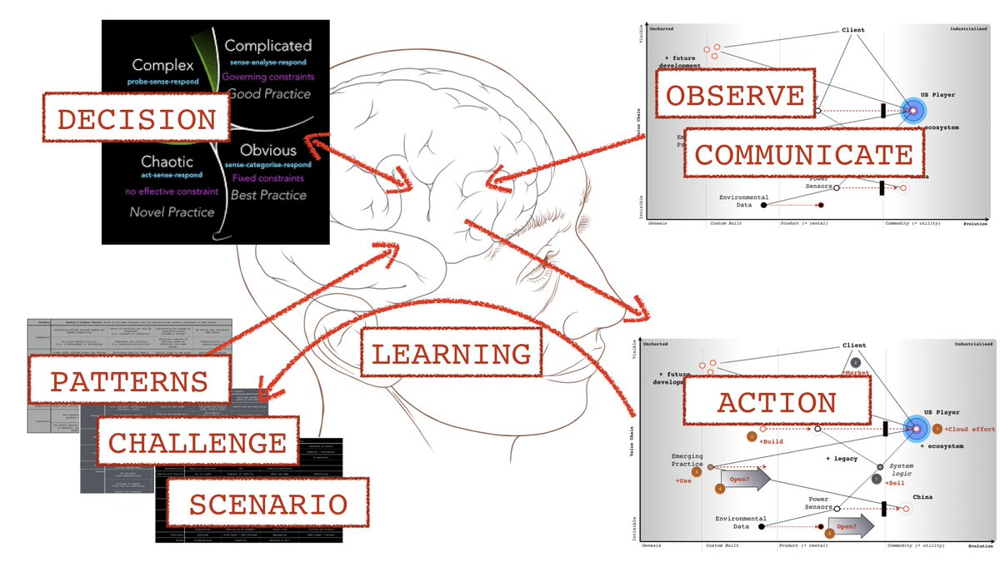

X : What do you actually do?

Me : Research. Privately funded. Currently working on culture. My area of interest is nation state competition.

X : Nation state?

Me : Yes, lots of fun. Lots of interesting aspects of mapping, take power relations for example - follow @tasshinfogleman

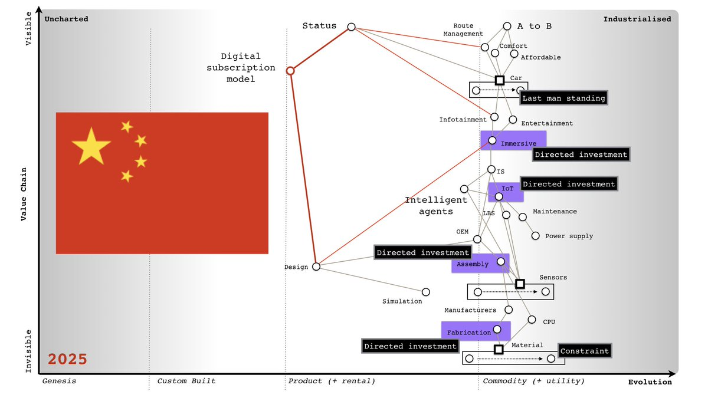

X : Which analysts do you use?

Me : None of the big ones. Though I follow lots of smart people e.g. @mjasay, @SalFreudenberg, @jacquitaylorfb, @timoreilly, @monkchips etc.
You should always follow @monkchips if you want to know what's happening in tech. 

X : Which consultancies do you use?

Me : None of the big ones. There are some good groups out there. Follow @martinfowler (Thoughtworks), @Rachel0404 (BeDifrent) or @jamesaduncan (Stance). I have a strong preference for practitioners.
