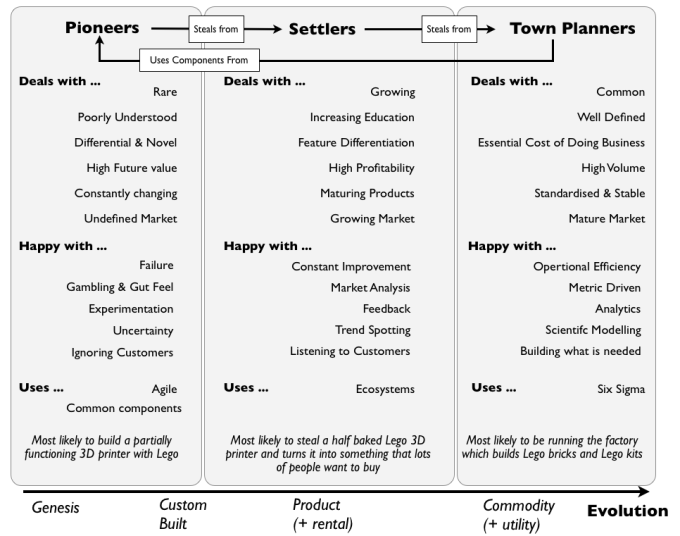

# On pioneer, settler and town planner 

source:  https://twitter.com/swardley/status/1471432725487927297?s=12

## Text

ok, first apologies for the awful naming. When I used the model fifteen years ago, I was thinking of more Viking settlers in Greenland and not the genocidal varieties. Still need to find better names ...

### Basics of the model Pioner/Sette/Town planner (PST) 

There are some really important basics with this model:

1. Everyone is brilliant: [https://blog.gardeviance.org/2015/03/on-pioneers-settlers-town-planners-and.html](https://blog.gardeviance.org/2015/03/on-pioneers-settlers-town-planners-and.html)
0. Everyone gets to choose and to change. This is about attitudes required for a particular component / project. People change ... often. Allow them to choose and change their attitude as much as they need to. FFS don't tell someone what they are, ask them and let them change.
0.  You need the system of theft. It won't work without it 
0. 
- The doctrine table below (a list of universally useful principles) is ordered into phases  
- those phases are built by mapping out the relationships between the principles, for example  
- at the very top of the tree you'll find PST 
- this means, if you don't get your principles sorted FIRST then you will fail at PST. If this is what your company looks like then don't even try it, PST isn't going to magically fix your organisation. Start with principles. 

If you look at the doctrine table, you'll see one of those principles is "provide mastery, autonomy and purpose". You DON'T provide or encourage mastery and autonomy by telling someone that they are a pioneer or whatever. They need to decide what they are - see point 2

### So, just remember

1. Everyone is brilliant.
1. Let people decide.
1. Implement a system of theft.
1. Don't start this path until you have your principles sorted.

### Discussion

How are you coming along with those terms?

I keep referring to Robert X. Cringley's Accidental Empires because PST was a derivative from this applied and fleshed out to a single company.

I avoided the Commando, Infantry and Police because of militaristic overtones but I see Pioneer, Settler and Town Planner is problematic in its own way. 

So, the model is fleshed out enough that I could just revert to origin. I don't mind the militaristic overtones and Commando, Infantry and Police gets the message across well he problem is other people mind it and it comes bundled with other imagery such as invasion, warfare and possibly oppression rather than building ... so I still don't know what the right words are.

PST is such a tiny part of mapping but such a thorn.

There are huge parts of mapping that I have chosen not to speak about in order to focus on basics. Why I descided to talk about PST is, well, most companies are nowhere near thinking about it. If I had a time machine I'd consign it to the "more trouble than worth" section.

I could (and probably) should have left it at as "Think aptitude and attitude" and "Design for constant evolution" rather than flesh it all out and explain how I managed those principle in more detail.  It's like the principle for "No single culture"  it's taken me over a decade to start talking about mapping culture and I'm far from convinced that was or is a good idea either.

But then others seem to find it useful ... gosh, I'm always torn on this stuff. I probably should just add "handle with care" notices to parts of mapping.

Examples of companies succeeding with PST?

Alas, it's not my place to say which companies. The one thing I would caution is that every company which has attempted it without sorting out their principles has failed. Leave the re-org until you've fixed your principles.

