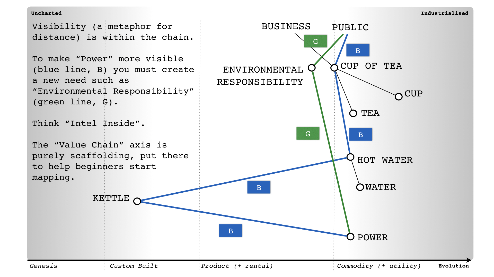
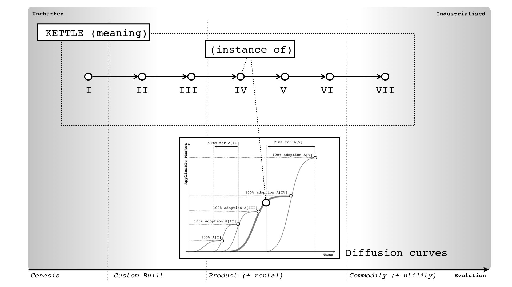
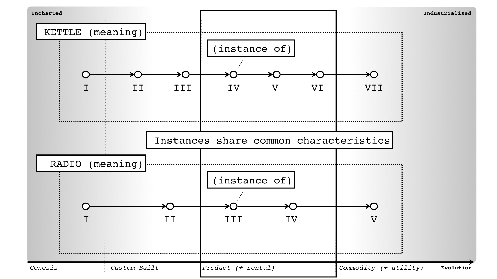
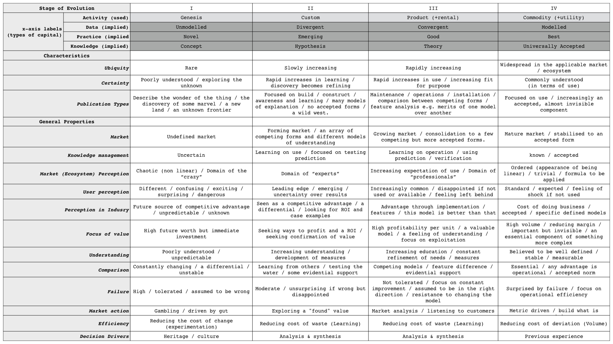

# Just Scaffolding

## Source from [twitter](https://twitter.com/swardley/status/1237707981116055552)

: The thing about Wardley's two axes is ...

: I only have one axis - the value chain is actually the chain itself.  I wish I had two but the "value chain axis" is simply scaffolding to help beginners map by pointing out a direction for visibility.

Within the evolution of a single meaning (i.e. kettle), there will be many instances (i.e. this product or that). Each instance has its own diffusion curve and applicable market (often related). Evolution of a single thing is not one diffusion curve but many, possibly hundreds.

Hence the early adopters to one instance (i.e. a product version of kettle) could be the laggards to another instance (i.e.  the commodity version of kettle).
With multiple meanings and multiple instances of evolving examples of those meanings ... what the evolution axis represents is a grouping of common characteristics across different meanings.

Hence, I was able to produce the cheat sheet ... a list of common characteristics.

So, #wardleymap lessons for today

1) The value chain axis is just scaffolding.
2) Evolution is not diffusion, evolution of a single meaning can consist of hundreds of diffusion curves.
3) Instances within the evolution of a single meaning can have common characteristics.
