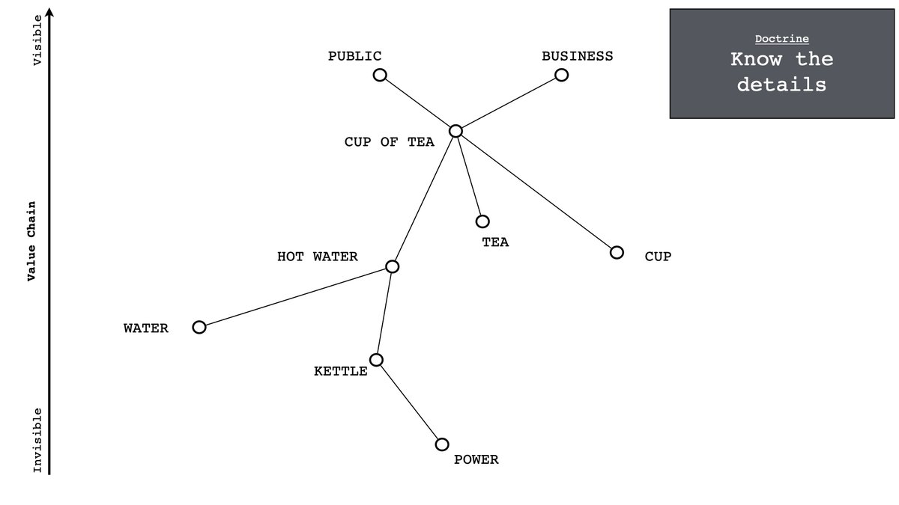
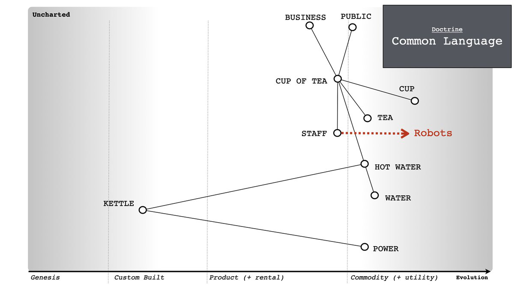

: We need to adapt to our new reality.

: A question?

: Should we start with organisation or operating model first?

: Neither. Start with doctrine i.e. basic principles of your company. This will lead you to landcape which will lead you to structure + operating model.

: Don't we need to get the structure right though?

: Structure against what? If you don't understand the landscape that you operate in then how do you structure around it? How do you decide what your operating model is? Awareness comes first and that needs those principles.

: Explain?

: Pretend you're running a tea shop (I'm a Brit, I like tea shops). First thing you need to do is to know who your users are - the public, the business for example (there are more like regulators etc).

... but just knowing the users is not enough, you need to know what they need i.e. a cup of tea, maybe something more like entertainment or a nice piece of fruitcake

... but just knowing what they need is not enough, you need to know what goes into making a cup of tea, the chain of chains that it is built upon. You need to know the details ...

... but knowing the details is not enough, there is a world of difference between a custom built kettle and one you buy from argos. so you need to understand what is being considered ... this is what we call a map ...

... now that we have a map, we have a common language where others can add components we are missing or discuss how we should think about those components ...

... because we have a common language, we can now challenge the assumptions because we are expressing our assumptions in the map. The key is to challenge the map (not the person) ... it's the map that's wrong ...

... as we build more maps, we discover we have duplication and bias between maps. We can literally see it by comparing maps and because we've now become good at challenging then we can remove it ...

... with our understand of the landscape, we can start to apply appropriate methods. All methods have a context where they work, there is no one size fits all ...

... we can embed challenge, communication (maps) and learning (i.e. which method goes where) through the use of pre and post mortems. We call this "spend control" and it's all about learning from those maps (i.e. data) rather than using data to justify a story we like.

... you have now completed all phase I of the doctrine. You have some awareness! Congratulations!

You have earned the right to talk about concepts like organisation, operating model and strategy ... just don't try and do them yet. You've got more principles to fix first.

: What about phase II?

: Have you done phase I?

: Not quite.

: Ok. Was the tea shop example useful.

: It's pretty good.

: Ok. Well, in which case I better put some maps together to explain phase II. Note to self ... #to_be_continued #phases

