By way of example, let us take something super simple (and @GoAgileGov) can confirm this. Let us take a systems diagram for creating a railway in a virtual world ... now to the questions ...
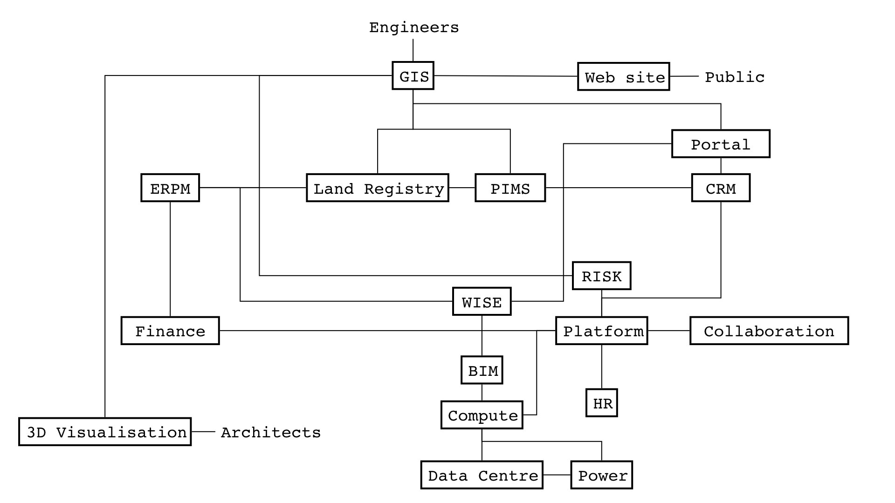

1. Do I outsource it all? 
or ...
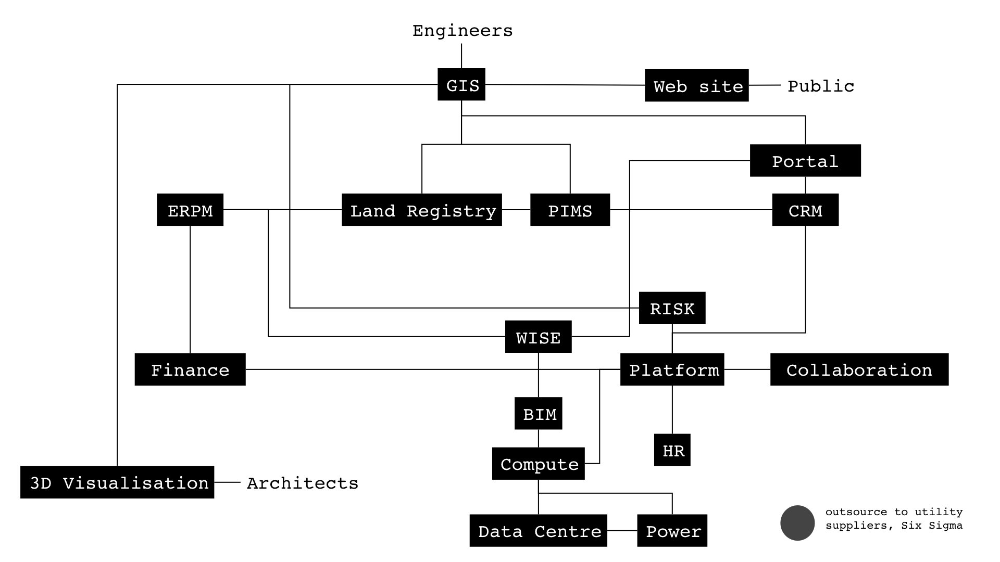

2. Do I use off the shelf products for it all?
or ...
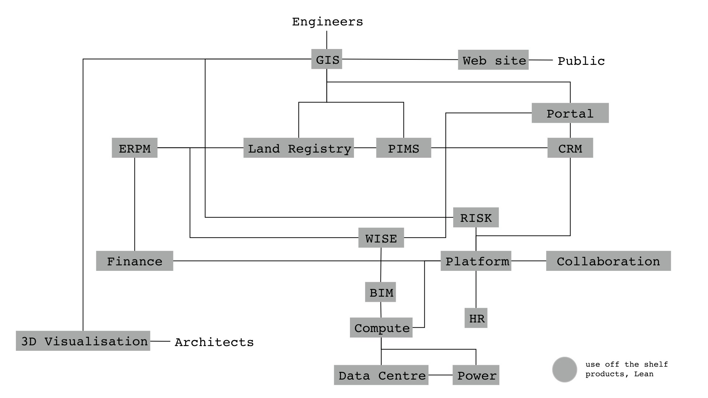

3. Do I build it all with Agile techniques? 
or ...
image:wardley_img_4.jpg_large[]

4. Do I use some combination of all three? Even with this simple diagram there are only 387 million permutations. How do I challenge what I am doing? Am I using the right technique in the right place?
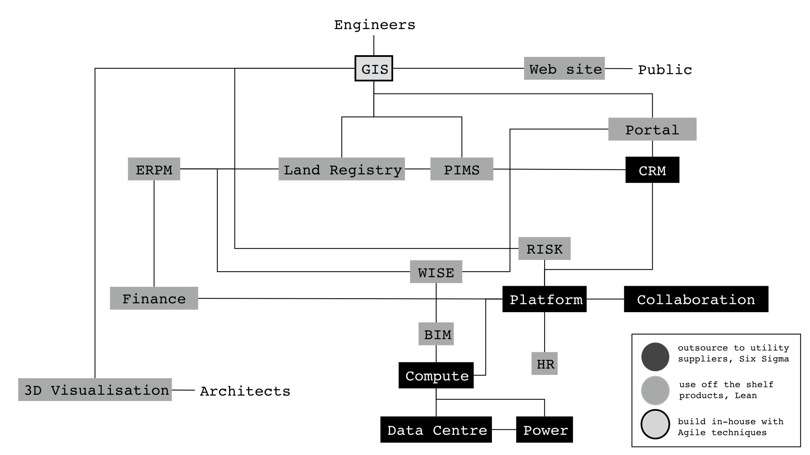

Now, this is a ridiculously simple example and even this is next to impossible to solve with policy and story telling. Even such a trivial example can only be solved through maps? 

But ... how?

1. You draw a map (this took @GoAgileGov a couple of hours tops). 
... then ...
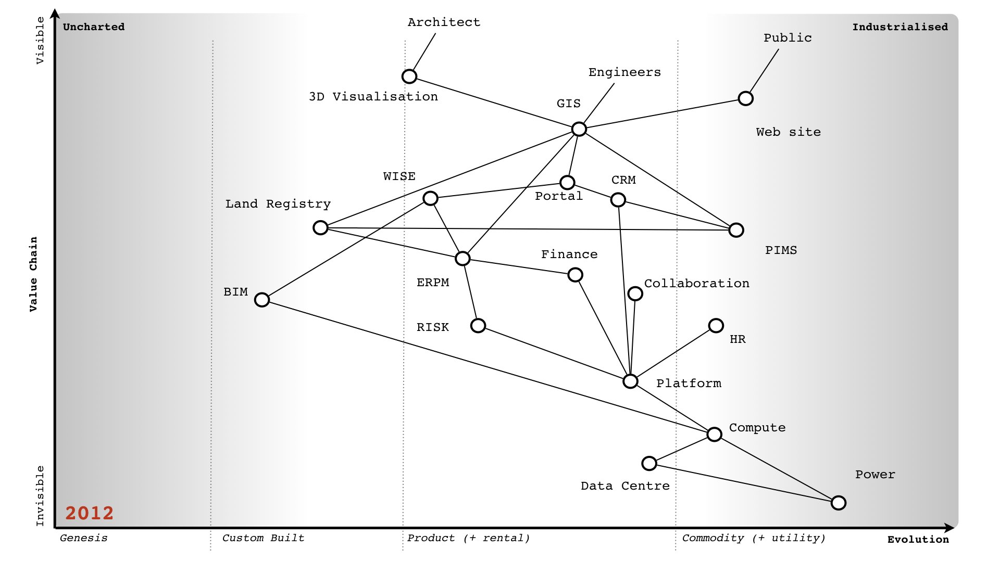

2. Because we know basic climatic patterns (go read the book if you need to - https://medium.com/wardleymaps ), we know one size doesn't fit all. 
... and so ...
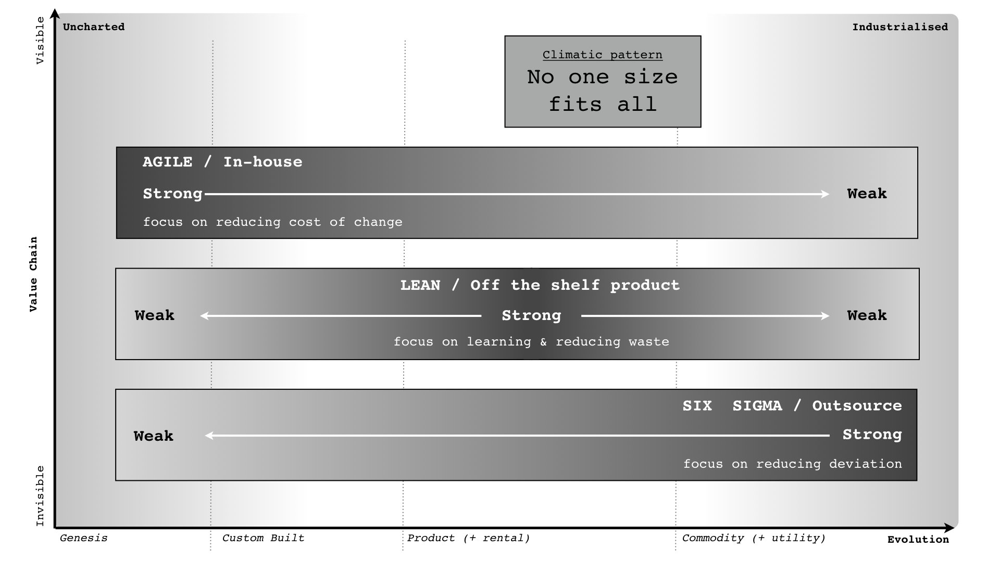

3. We can therefore apply appropriate methods.
... and if you really want to  ...  
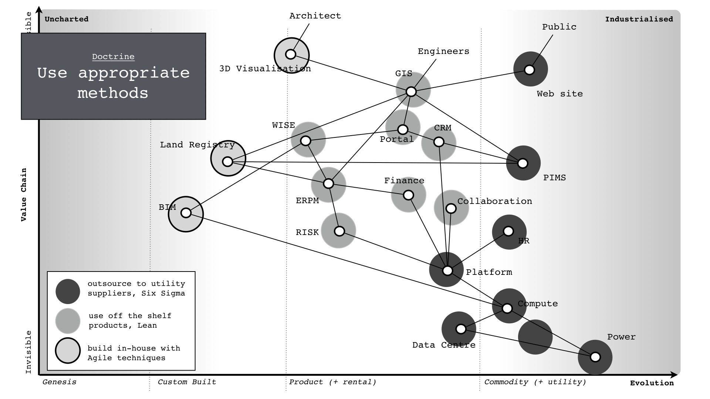

4. We can turn it back into a systems diagram if necessary. This can all be done in hours.  Try solving that problem with story telling, customer journey and policy. You'll be there for a decade and get nowhere. 387 million permutations, good luck with that.
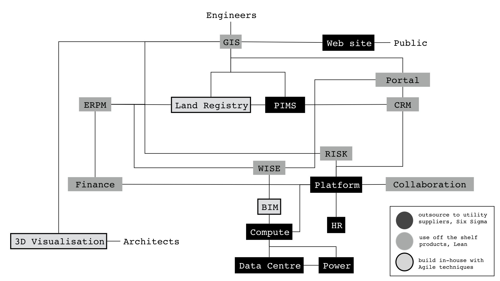

... and this, is the most basic of all problems. Ditto duplication etc and we haven't even started down the route of strategy. It's why when people say to me they want to talk strategy, I ask for maps ... if they have none, I laugh and walk away. Waste of my time.
X : But how do you know which methods work where?
Me : Learning! You not only use maps to communicate and challenge but also to learn. 
For example ...

1. Let us take that systems diagram and suppose we have decided to outsource it all ...
... let's have a look at the mapping version ...

2. In the mapping version we have decided not to use appropriate methods. 
... well, before we've even started I can tell you ...
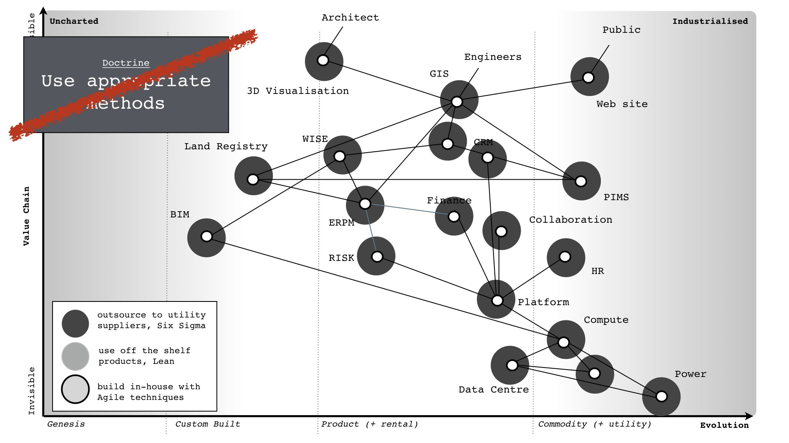

3. That some parts will be effectively treated (on the right, because we can specify them) but some parts on the left will incur excessive change control costs (due to change) and will be seen to fail.
... I can even ...
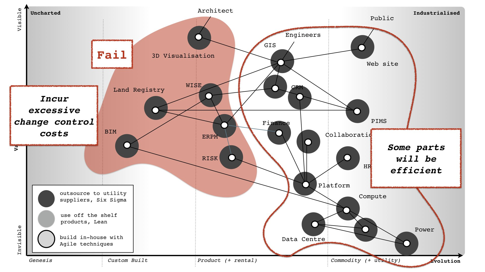

4. Turn this back into a systems diagram and show where the failure is likely to occur (again ask @GoAgileGov if you doubt me).
... it's from this that ...
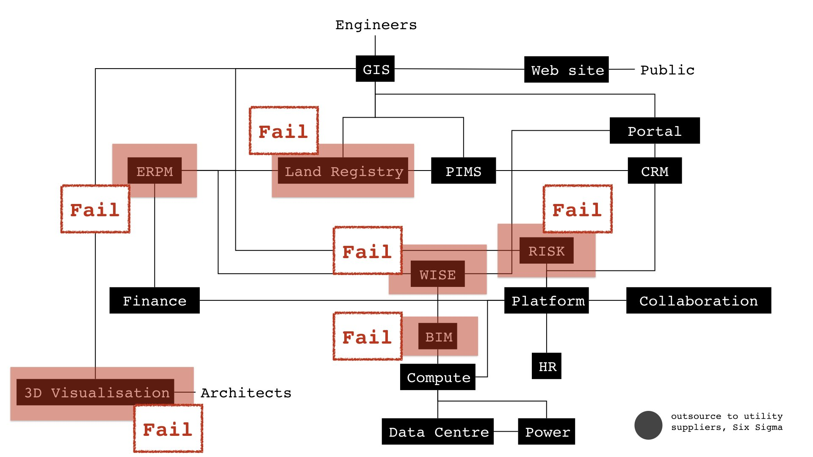

5. We learn basic climatic patterns i.e. where methods work. This really is child's play, my nine year old kid can do this stuff. It's amazing how many billion$ are wasted due to lack of the most basic concepts in business and use of ridiculous tools like SWOTs, 2x2s, P&Ls.

... so please don't come to me with your agile everywhere, story telling, policy driven, use devops, spotify ourselves, magic pixie dust solutions to the world.  If you have no maps then you're not communicating, challenging, learning and you're nowhere when it comes to strategy.

X : But, you would say that, you're a consultant selling maps.
Me : 
a) The entire process is creative commons - https://medium.com/wardleymaps  - which means learn yourself. Many do.
b) The only people that can effectively map a space are those that live within it.  That means you.

.. so yes, I am literally the world's worst "selling maps" consultant because I tell everyone that they have to learn, they have to map and I refuse to map for them. I even made the entire method creative commons over  a decade ago.

X : What's wrong with income statements, they are a standard way of examining a company?
Me : Oh dear. Ok.
... let us take a Tea Shop ...

1. I've provided a very simplified Income statement (per cup of tea sold) for a Tea Shop called "X". I've also added a KPI (as % of revenue) and comparison to another Tea Shop called "Y". Spend a few minutes looking at it. Can you see what's wrong?
... let's explore more ...
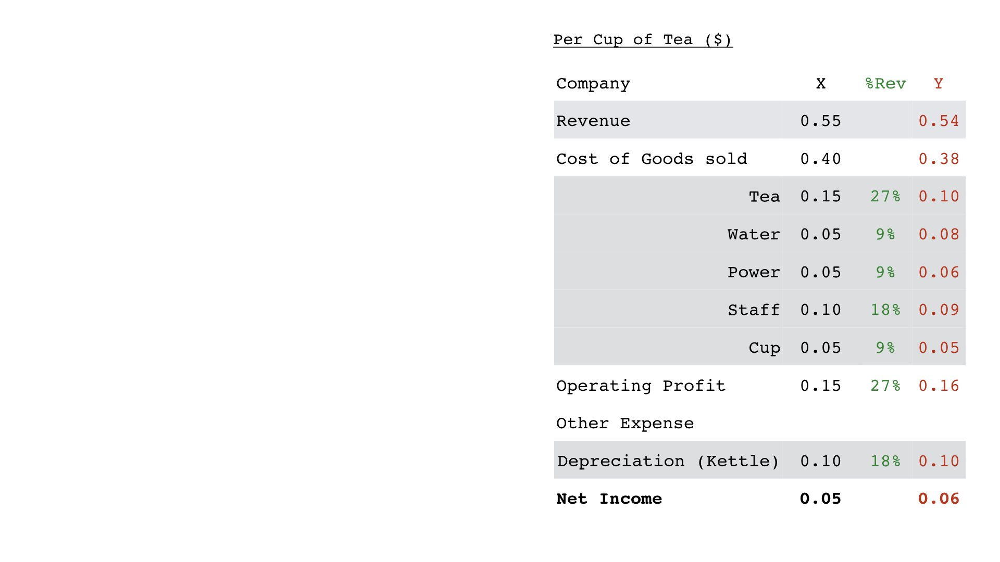

2. We shall start by adding a value chain which describes the tea shop. Have a look. Have you solved the problem? 
... need some more help, no problem ...
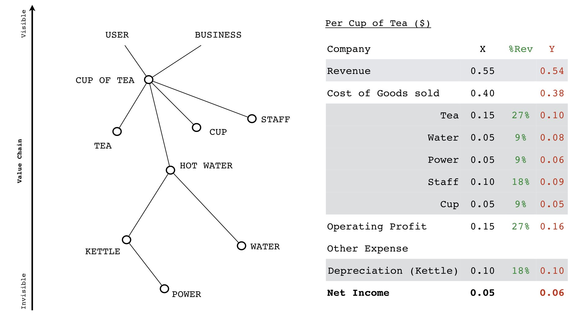

3. Ok, the value chain represents flows of capital. Each node is a stock of capital, the lines are exchanges. The types of capital can be many forms e.g. customer pays money (financial) for a cup of tea (physical). Does that help?
... no problem, lets add more ...
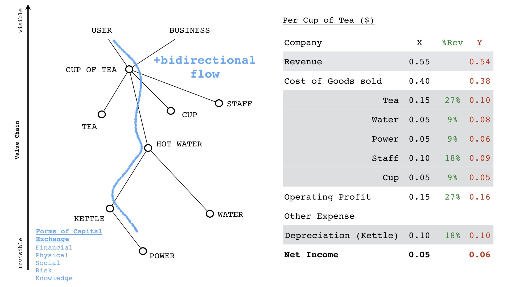

4. We may as well add figures for the exchanges. I'll ignore the physical capital flow (i.e. the cup of tea, the tea itself, the pouring of hot water) and just concentrate on money. Does this help? Give yourself a few minutes.
... have you spotted the problem? ...
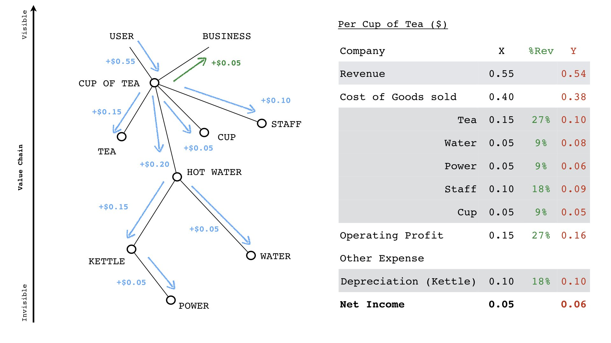

5. No? Ok, lets add the map version (i.e. not the value chain). Can you spot the problem now? 
... wait, they're not ...

... custom building kettles? Yep. You wouldn't believe the nonsense I see in some companies. But why didn't I see that in the income statement or comparison to other companies? Because you won't especially if everyone is custom building kettles. Income Statements lack context.

X : Oh, this can't be real?
Me : Oh, yes it is. I have some true industry wide horrors. I'll tweet about one later but for now I'll just let you ponder how useful Income Statements and KPIs really are. For me, they're up there with SWOTs in the category of the fairly useless.

It's only when you add context (e.g. by use of a map) do you discover the horrors of what we actually do in many corporations.

